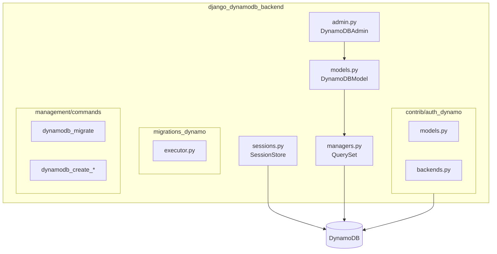

# Contributing to Django DynamoDB Backend

We welcome contributions! This document provides guidelines for contributing to the project.

## Getting Started

### Prerequisites

- Python 3.11+
- Django 5.2+ or Django 6.0+
- Docker and Docker Compose (for LocalStack DynamoDB)

### Development Setup

1. **Fork and Clone**

```bash
git clone https://github.com/YOUR-USERNAME/django-dynamodb-backend.git
cd django-dynamodb-backend
```

2. **Install Dependencies**

```bash
pip install -e ".[dev]"
```

3. **Start LocalStack (DynamoDB)**

```bash
docker compose up -d localstack
```

4. **Run Tests**

```bash
python -m pytest tests/
```

5. **Run the Demo** (optional)

```bash
make demo
# Visit http://localhost:8001/admin/ (admin/admin123)
```

## Development Workflow

### Code Style

We use automated formatting tools:

```bash
# Format code
black .
isort .

# Check formatting
black --check .
isort --check-only .

# Lint
flake8 .
```

### Making Changes

1. Create a feature branch:
```bash
git checkout -b feature/your-feature
```

2. Make your changes and ensure tests pass

3. Format your code:
```bash
black .
isort .
```

4. Commit with a descriptive message:
```bash
git commit -m "feat: add your feature description"
```

5. Push and create a pull request:
```bash
git push origin feature/your-feature
```

### Commit Message Format

We follow conventional commits:

- `feat:` - New features
- `fix:` - Bug fixes
- `docs:` - Documentation changes
- `test:` - Test changes
- `ci:` - CI/CD changes
- `refactor:` - Code refactoring
- `chore:` - Maintenance tasks

## Testing

### Running Tests

```bash
# Run all tests
python -m pytest tests/

# Run unit tests only
python -m pytest tests/unit/

# Run with coverage
python -m pytest --cov=src/django_dynamodb_backend

# Run specific test file
python -m pytest tests/unit/test_fields.py
```

### Test Structure

```
tests/
├── unit/           # Unit tests
├── integration/    # Integration tests
└── performance/    # Performance tests
```

## Project Structure



Key modules in `src/django_dynamodb_backend/`:

| Module | Description |
|--------|-------------|
| `models.py` | Base DynamoDBModel class |
| `managers.py` | QuerySet implementation with Django ORM compatibility |
| `admin.py` | DynamoDBAdmin for Django admin integration |
| `sessions.py` | DynamoDB session backend |
| `contrib/auth_dynamo/` | DynamoDB-backed authentication (users, permissions) |
| `migrations_dynamo/` | DynamoDB migration system |
| `management/commands/` | Management commands for table creation |

### Sessions Module (`sessions.py`)

Provides Django session storage backed by DynamoDB with TTL for automatic expiration.

### Auth Module (`contrib/auth_dynamo/`)

Provides DynamoDB-backed user authentication:
- `models.py` - DynamoUser model
- `managers.py` - DynamoUserManager with GSI lookups
- `backends.py` - DynamoAuthBackend for Django authentication
- `admin.py` - Admin interface for user management
- `forms.py` - User creation and change forms

## Pull Request Guidelines

1. Update documentation if needed
2. Add tests for new functionality
3. Ensure all CI checks pass
4. Keep changes focused and atomic
5. Write clear commit messages

## Useful Make Commands

```bash
make demo          # Start the demo environment
make test          # Run tests
make lint          # Run linters (black, isort, flake8)
make format        # Auto-format code
make clean         # Clean up containers and cache
```

## Related Documentation

For user-facing documentation, see the [Documentation Index](docs/INDEX.md).

## Questions?

Open an issue for questions or discussion.
