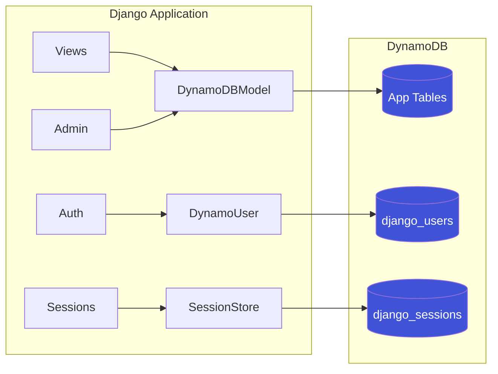

# Django DynamoDB Backend

A Django database backend and admin integration for Amazon DynamoDB. Run Django **100% on DynamoDB** — no PostgreSQL, MySQL, or SQLite required.

[](https://github.com/jpwhite3/django-dynamodb-backend/actions/workflows/ci.yml)
[](https://www.python.org/downloads/)
[](https://www.djangoproject.com/)
[](https://opensource.org/licenses/MIT)

## Architecture



## Features

- **🚀 100% DynamoDB**: Run Django without any relational database — sessions, users, and admin all on DynamoDB
- **🔐 DynamoDB Authentication**: Full user auth system with username/email GSIs, password hashing, and permissions
- **🍪 DynamoDB Sessions**: Session backend with automatic TTL-based expiration
- **⚡ Django Admin**: Complete admin interface support with DynamoDB optimizations
- **📦 Django ORM Compatible**: Familiar QuerySet API, Q objects, aggregations, and more
- **🔄 Migration System**: DynamoDB-specific table and index management
- **💰 Cost Optimized**: Pay-per-request billing, fits within AWS free tier for development
- **☁️ Serverless Ready**: Perfect for AWS Lambda deployments

## Requirements

- Python 3.11+
- Django 5.2+
- boto3, pynamodb
- Docker (optional — for the demo; not needed for development)

## Quick Start

### 🎯 Try the Demo (30 seconds)

The fastest way to explore — runs entirely on DynamoDB with no other databases:

```bash
git clone https://github.com/jpwhite3/django-dynamodb-backend.git
cd django-dynamodb-backend
make demo
```

This starts:
- **LocalStack** (local DynamoDB emulator)
- **Django Admin** at http://localhost:8001/admin/
- **Sample data** (blog posts, products, orders)

**Login:** `admin` / `admin123`

> 🎉 **No Redis, PostgreSQL, or SQLite** — everything runs on DynamoDB!

Demo commands:
```bash
make demo        # Start demo
make demo-stop   # Stop demo
make demo-reset  # Reset and restart
make demo-logs   # View logs
```

### 🖥️ Quick Start Without Docker

If you prefer to run locally without Docker, install [LocalStack CLI](https://docs.localstack.cloud/getting-started/installation/) (or use a real AWS account) and run:

```bash
git clone https://github.com/jpwhite3/django-dynamodb-backend.git
cd django-dynamodb-backend
pip install -e ".[dev]"

# Start LocalStack in the background (or point to real AWS)
localstack start -d

# Run the test suite
python -m pytest tests/
```

---

## Installation

```bash
# Clone the repository
git clone https://github.com/jpwhite3/django-dynamodb-backend.git
cd django-dynamodb-backend

# Install with pip
pip install -e .
```

---

## Configuration

### Option 1: DynamoDB-Only Mode (Recommended)

Run Django entirely on DynamoDB — ideal for serverless deployments:

```python
# settings.py
INSTALLED_APPS = [
    'django.contrib.admin',
    'django.contrib.auth',
    'django.contrib.contenttypes',
    'django.contrib.sessions',
    'django.contrib.messages',
    'django.contrib.staticfiles',
    # DynamoDB backend
    'django_dynamodb_backend',
    'django_dynamodb_backend.contrib.auth_dynamo',  # DynamoDB users
]

# Database
DATABASES = {
    'default': {
        'ENGINE': 'django_dynamodb_backend.db',
        'NAME': 'my_app',
        'OPTIONS': {
            'region_name': 'us-east-1',
            'endpoint_url': 'http://localhost:4566',  # LocalStack for dev
            'aws_access_key_id': 'test',
            'aws_secret_access_key': 'test',
        },
    }
}

# Sessions — stored in DynamoDB with TTL
SESSION_ENGINE = 'django_dynamodb_backend.sessions'
DYNAMODB_SESSION_TABLE_NAME = 'django_sessions'

# Authentication — DynamoDB users with GSIs
AUTH_USER_MODEL = 'auth_dynamo.DynamoUser'
DYNAMODB_USER_TABLE_NAME = 'django_users'
AUTHENTICATION_BACKENDS = [
    'django_dynamodb_backend.contrib.auth_dynamo.backends.DynamoAuthBackend',
]

# Cache (local memory — or use ElastiCache in production)
CACHES = {
    'default': {
        'BACKEND': 'django.core.cache.backends.locmem.LocMemCache',
    }
}
```

### Create Tables

```bash
# Create sessions table (with TTL)
python manage.py dynamodb_create_session_table

# Create users table (with GSIs) and admin user
python manage.py dynamodb_create_user_table --create-admin

# Or create a superuser interactively (like Django's createsuperuser)
python manage.py dynamodb_createsuperuser

# Create your app's tables
python manage.py dynamodb_migrate
```

### Option 2: Hybrid Mode

Use DynamoDB for your models while keeping PostgreSQL/SQLite for Django's built-in apps:

```python
# settings.py
INSTALLED_APPS = [
    'django.contrib.admin',
    'django.contrib.auth',
    'django.contrib.contenttypes',
    'django.contrib.sessions',
    'django.contrib.messages',
    'django.contrib.staticfiles',
    'django_dynamodb_backend',
]

DATABASES = {
    'default': {
        'ENGINE': 'django_dynamodb_backend.db',
        'NAME': 'my_app',
        'OPTIONS': {
            'region_name': 'us-east-1',
        },
    }
}
```

---

## Define Models

```python
from django.db import models
from django_dynamodb_backend.models import DynamoDBModel

class BlogPost(DynamoDBModel):
    id = models.CharField(primary_key=True, max_length=36)
    title = models.CharField(max_length=200)
    content = models.TextField()
    author = models.CharField(max_length=100)
    published = models.BooleanField(default=False)
    created_at = models.DateTimeField(auto_now_add=True)
    
    class Meta:
        db_table = 'blog_posts'
    
    def __str__(self):
        return self.title
```

## Admin Interface

```python
from django.contrib import admin
from django_dynamodb_backend.admin import DynamoDBAdmin
from .models import BlogPost

@admin.register(BlogPost)
class BlogPostAdmin(DynamoDBAdmin):
    list_display = ['title', 'author', 'published', 'created_at']
    list_filter = ['published', 'author']
    search_fields = ['title', 'content']
```

---

## Management Commands

| Command | Description |
|---------|-------------|
| `dynamodb_create_session_table` | Create sessions table with TTL |
| `dynamodb_create_user_table` | Create users table with GSIs |
| `dynamodb_create_user_table --create-admin` | Also create admin user |
| `dynamodb_migrate` | Apply DynamoDB migrations |
| `dynamodb_makemigrations` | Create new migrations |
| `dynamodb_showmigrations` | Show migration status |
| `dynamodb_rollback` | Rollback migrations |

---

## DynamoDB Table Schemas

### Sessions Table (`django_sessions`)
- **Partition Key**: `session_key` (String)
- **TTL Attribute**: `expire_date` (Unix timestamp)
- **Billing**: Pay-per-request

### Users Table (`django_users`)
- **Partition Key**: `id` (String, UUID)
- **GSI `username-index`**: Lookup by username
- **GSI `email-index`**: Lookup by email
- **Billing**: Pay-per-request

---

## Project Structure

```
django-dynamodb-backend/
├── src/django_dynamodb_backend/
│   ├── admin.py                 # Django Admin integration
│   ├── models.py                # DynamoDB model base class
│   ├── managers.py              # QuerySet implementation
│   ├── sessions.py              # DynamoDB session backend
│   ├── contrib/
│   │   └── auth_dynamo/         # DynamoDB authentication
│   │       ├── models.py        # DynamoUser model
│   │       ├── managers.py      # User manager
│   │       ├── backends.py      # Auth backend
│   │       ├── admin.py         # User admin
│   │       └── forms.py         # User forms
│   ├── db/                      # Database backend
│   └── management/commands/     # Management commands
├── examples/demo_project/       # Demo application
├── tests/                       # Test suite
└── docs/                        # Documentation
```

---

## Documentation

📚 **[Documentation Index](docs/INDEX.md)** — Find the right doc for your needs

| Document | Description |
|----------|-------------|
| [Migration Tutorial](docs/MIGRATION_TUTORIAL.md) | Step-by-step guide to migrate existing Django projects |
| [Django Compatibility](docs/DJANGO_COMPATIBILITY.md) | Supported ORM features and limitations |
| [API Reference](docs/API_REFERENCE.md) | Complete API documentation |
| [Deployment Guide](docs/DEPLOYMENT_GUIDE.md) | Production & serverless deployment |
| [Feature Walkthrough](docs/FEATURE_WALKTHROUGH.md) | Detailed feature guide with demos |

---

## Development

```bash
# Setup
git clone https://github.com/jpwhite3/django-dynamodb-backend.git
cd django-dynamodb-backend
pip install -e ".[dev]"

# Lint
black .
isort .
flake8 .

# Test
python -m pytest tests/
```

## Contributing

Contributions welcome! See [CONTRIBUTING.md](CONTRIBUTING.md).

## License

MIT License — see [LICENSE](LICENSE).

## Links

- [GitHub](https://github.com/jpwhite3/django-dynamodb-backend)
- [Issues](https://github.com/jpwhite3/django-dynamodb-backend/issues)
