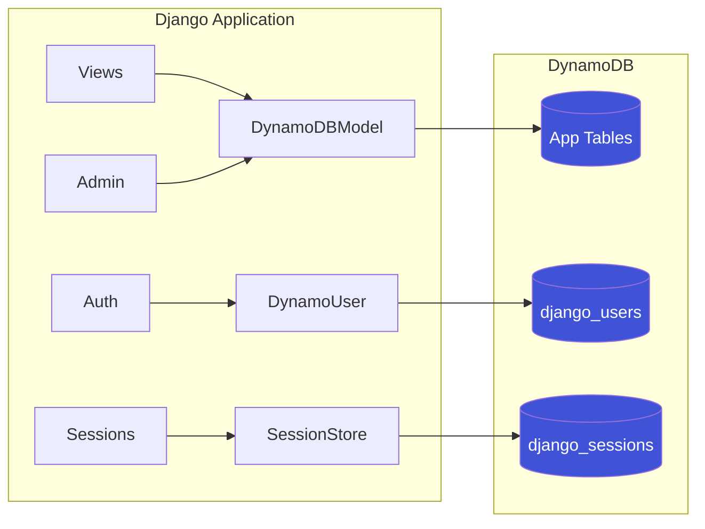

# Architecture

How `django_dynamodb_backend` fits between a Django application and DynamoDB.

## Component overview



A Django request hits one of three integration points:

- **Models / admin / views** call into `DynamoDBModel` (and its manager / queryset), which translates Django ORM operations into PynamoDB / boto3 calls against your application's DynamoDB tables.
- **Authentication** is rerouted through `DynamoUser` + `DynamoAuthBackend`, backed by a dedicated `django_users` table with GSIs on `username` and `email` for O(1) lookups.
- **Sessions** use `SessionStore`, which writes session data into `django_sessions` with a DynamoDB TTL attribute so expired sessions are removed automatically.

No relational database is required — `django.contrib.contenttypes` and friends are not used by the DynamoDB path. (You can still run in hybrid mode with PostgreSQL or SQLite for Django's built-in apps if you prefer.)

## Repository layout

```
django-dynamodb-backend/
├── src/django_dynamodb_backend/
│   ├── admin.py                 # Django Admin integration
│   ├── models.py                # DynamoDB model base class
│   ├── managers.py              # QuerySet implementation
│   ├── sessions.py              # DynamoDB session backend
│   ├── contrib/
│   │   └── auth_dynamo/         # DynamoDB authentication
│   │       ├── models.py        # DynamoUser model
│   │       ├── managers.py      # User manager
│   │       ├── backends.py      # Auth backend
│   │       ├── admin.py         # User admin
│   │       └── forms.py         # User forms
│   ├── db/                      # Database backend
│   └── management/commands/     # Management commands
├── examples/demo_project/       # Demo application
├── tests/                       # Test suite
└── docs/                        # Documentation
```

## See also

- [Django Compatibility](DJANGO_COMPATIBILITY.md) — which Django ORM features are supported and where they differ
- [API Reference](API_REFERENCE.md) — module-by-module API documentation
- [Feature Walkthrough](FEATURE_WALKTHROUGH.md) — detailed feature guide with examples
