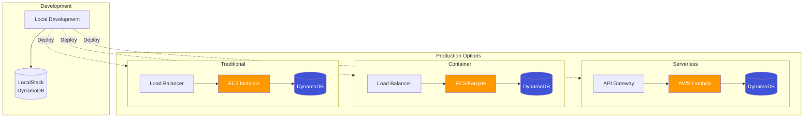
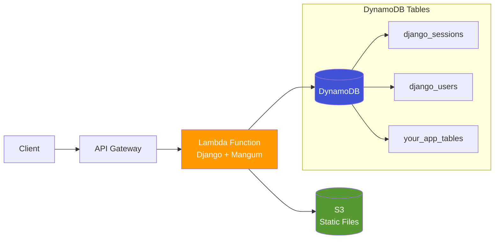

# DynamoDB Django Admin - Deployment Guide

This guide covers deploying Django with DynamoDB in various environments, from development to production.

## Deployment Architecture Overview



## Table of Contents

- [Quick Start (DynamoDB-Only)](#quick-start-dynamodb-only)
- [Development Setup](#development-setup)
- [Serverless Deployment (AWS Lambda)](#serverless-deployment-aws-lambda)
- [AWS Production Deployment](#aws-production-deployment)
- [Docker Deployment](#docker-deployment)
- [Performance Optimization](#performance-optimization)
- [Monitoring and Logging](#monitoring-and-logging)
- [Security Best Practices](#security-best-practices)
- [Troubleshooting](#troubleshooting)

---

## Quick Start (DynamoDB-Only)

The fastest way to get started is using **DynamoDB-only mode**, which runs Django entirely on DynamoDB without any relational database.

```bash
# Clone and setup
git clone https://github.com/your-org/django-dynamodb-backend.git
cd django-dynamodb-backend

# Start the demo (DynamoDB-only)
make demo

# Visit http://localhost:8001/admin/ (admin/admin123)
```

This starts:
- Django with DynamoDB sessions and authentication
- LocalStack providing DynamoDB
- No PostgreSQL, Redis, or SQLite required!

See [Django Compatibility Guide](DJANGO_COMPATIBILITY.md#dynamodb-only-deployment) for detailed configuration.

---

## Development Setup

### Prerequisites

- Python 3.11+
- Docker and Docker Compose (recommended)
- AWS CLI (optional)

### 1. DynamoDB Local Setup

#### Option A: Docker Compose (Recommended)

```bash
# Start LocalStack with DynamoDB
docker compose up -d localstack
```

#### Option B: Standalone Docker

```bash
# Run DynamoDB Local in Docker
docker run -p 8000:8000 -v "$PWD/dynamodb-data":/home/dynamodblocal/data \
  amazon/dynamodb-local -jar DynamoDBLocal.jar -sharedDb -dbPath /home/dynamodblocal/data
```

### 2. Django Configuration (DynamoDB-Only)

Create `settings/development.py`:

```python
from .base import *

DEBUG = True
ALLOWED_HOSTS = ['localhost', '127.0.0.1']

# DynamoDB Configuration
DYNAMODB_ENDPOINT_URL = 'http://localhost:8000'
DYNAMODB_REGION = 'us-east-1'
AWS_ACCESS_KEY_ID = 'testing'
AWS_SECRET_ACCESS_KEY = 'testing'

# DynamoDB Sessions (no Redis needed)
SESSION_ENGINE = 'django_dynamodb_backend.sessions'
DYNAMODB_SESSION_TABLE_NAME = 'django_sessions'

# DynamoDB Authentication (no django.contrib.auth needed)
INSTALLED_APPS = [
    'django.contrib.admin',
    'django.contrib.contenttypes',
    'django.contrib.messages',
    'django.contrib.staticfiles',
    'django_dynamodb_backend',
    'django_dynamodb_backend.contrib.auth_dynamo',
    # Your apps here
]

AUTH_USER_MODEL = 'auth_dynamo.DynamoUser'
DYNAMODB_USER_TABLE_NAME = 'django_users'

AUTHENTICATION_BACKENDS = [
    'django_dynamodb_backend.contrib.auth_dynamo.backends.DynamoAuthBackend',
]

# Development logging
LOGGING = {
    'version': 1,
    'disable_existing_loggers': False,
    'handlers': {
        'console': {
            'class': 'logging.StreamHandler',
        },
    },
    'root': {
        'handlers': ['console'],
        'level': 'INFO',
    },
}

# Cache (optional - use in-memory for development)
CACHES = {
    'default': {
        'BACKEND': 'django.core.cache.backends.locmem.LocMemCache',
        'LOCATION': 'unique-snowflake',
    }
}
```

### 3. Development Commands

```bash
# Create DynamoDB tables for sessions and users
python manage.py dynamodb_create_session_table
python manage.py dynamodb_create_user_table --create-admin

# Apply app migrations
python manage.py dynamodb_migrate

# Run development server
python manage.py runserver
```

### 4. Development Tools

#### Admin Debug Toolbar (Optional)

```python
# settings/development.py (additional)
INSTALLED_APPS += ['debug_toolbar']
MIDDLEWARE += ['debug_toolbar.middleware.DebugToolbarMiddleware']

DEBUG_TOOLBAR_CONFIG = {
    'SHOW_TOOLBAR_CALLBACK': lambda request: DEBUG,
}

# URLs
from django.conf import settings
if settings.DEBUG:
    import debug_toolbar
    urlpatterns = [
        path('__debug__/', include(debug_toolbar.urls)),
    ] + urlpatterns
```

---

## Serverless Deployment (AWS Lambda)

Django with DynamoDB-only mode is ideal for serverless deployments. No database connections to manage!



### 1. Project Structure

```
my-django-app/
├── app/
│   ├── settings.py
│   ├── urls.py
│   └── wsgi.py
├── myapp/
│   └── models.py
├── requirements.txt
├── serverless.yml
└── handler.py
```

### 2. Lambda Settings

```python
# app/settings.py
import os

DEBUG = False
ALLOWED_HOSTS = ['*']

# DynamoDB Configuration (uses Lambda's IAM role)
DYNAMODB_REGION = os.environ.get('AWS_REGION', 'us-east-1')
# No endpoint URL needed - uses real DynamoDB

# DynamoDB Sessions
SESSION_ENGINE = 'django_dynamodb_backend.sessions'
DYNAMODB_SESSION_TABLE_NAME = os.environ.get('SESSION_TABLE', 'django_sessions')

# DynamoDB Authentication
INSTALLED_APPS = [
    'django.contrib.admin',
    'django.contrib.contenttypes',
    'django.contrib.messages',
    'django.contrib.staticfiles',
    'django_dynamodb_backend',
    'django_dynamodb_backend.contrib.auth_dynamo',
    'myapp',
]

AUTH_USER_MODEL = 'auth_dynamo.DynamoUser'
DYNAMODB_USER_TABLE_NAME = os.environ.get('USER_TABLE', 'django_users')

AUTHENTICATION_BACKENDS = [
    'django_dynamodb_backend.contrib.auth_dynamo.backends.DynamoAuthBackend',
]

# Security
SECRET_KEY = os.environ['DJANGO_SECRET_KEY']
SECURE_SSL_REDIRECT = True
```

### 3. Serverless Configuration

```yaml
# serverless.yml
service: django-dynamodb-app

provider:
  name: aws
  runtime: python3.11
  region: us-east-1
  environment:
    DJANGO_SETTINGS_MODULE: app.settings
    DJANGO_SECRET_KEY: ${ssm:/django-app/secret-key}
    SESSION_TABLE: ${self:service}-sessions-${sls:stage}
    USER_TABLE: ${self:service}-users-${sls:stage}
  iam:
    role:
      statements:
        - Effect: Allow
          Action:
            - dynamodb:GetItem
            - dynamodb:PutItem
            - dynamodb:UpdateItem
            - dynamodb:DeleteItem
            - dynamodb:Query
            - dynamodb:Scan
            - dynamodb:BatchGetItem
            - dynamodb:BatchWriteItem
          Resource:
            - arn:aws:dynamodb:${aws:region}:${aws:accountId}:table/${self:service}-*

functions:
  api:
    handler: handler.handler
    events:
      - httpApi: '*'

resources:
  Resources:
    SessionsTable:
      Type: AWS::DynamoDB::Table
      Properties:
        TableName: ${self:service}-sessions-${sls:stage}
        BillingMode: PAY_PER_REQUEST
        AttributeDefinitions:
          - AttributeName: session_key
            AttributeType: S
        KeySchema:
          - AttributeName: session_key
            KeyType: HASH
        TimeToLiveSpecification:
          AttributeName: expire_date
          Enabled: true

    UsersTable:
      Type: AWS::DynamoDB::Table
      Properties:
        TableName: ${self:service}-users-${sls:stage}
        BillingMode: PAY_PER_REQUEST
        AttributeDefinitions:
          - AttributeName: id
            AttributeType: S
          - AttributeName: username
            AttributeType: S
          - AttributeName: email
            AttributeType: S
        KeySchema:
          - AttributeName: id
            KeyType: HASH
        GlobalSecondaryIndexes:
          - IndexName: username-index
            KeySchema:
              - AttributeName: username
                KeyType: HASH
            Projection:
              ProjectionType: ALL
          - IndexName: email-index
            KeySchema:
              - AttributeName: email
                KeyType: HASH
            Projection:
              ProjectionType: ALL
```

### 4. Lambda Handler

```python
# handler.py
import os
os.environ.setdefault('DJANGO_SETTINGS_MODULE', 'app.settings')

import django
django.setup()

from mangum import Mangum
from app.wsgi import application

handler = Mangum(application, lifespan='off')
```

### 5. Deploy

```bash
# Install serverless
npm install -g serverless

# Deploy
serverless deploy --stage prod

# Create admin user (one-time)
serverless invoke -f api --data '{"manage": "dynamodb_create_user_table --create-admin"}'
```

### Benefits of Serverless DynamoDB-Only

- **No cold start database connections**: DynamoDB is HTTP-based
- **Automatic scaling**: Both Lambda and DynamoDB scale automatically
- **Pay-per-use**: Only pay for actual requests
- **Zero maintenance**: No database servers to manage
- **Global deployment**: Easy multi-region with DynamoDB Global Tables

---

## AWS Production Deployment

### 1. AWS IAM Setup

Create an IAM role with DynamoDB permissions:

```json
{
    "Version": "2012-10-17",
    "Statement": [
        {
            "Effect": "Allow",
            "Action": [
                "dynamodb:CreateTable",
                "dynamodb:DeleteTable",
                "dynamodb:DescribeTable",
                "dynamodb:ListTables",
                "dynamodb:GetItem",
                "dynamodb:PutItem",
                "dynamodb:Query",
                "dynamodb:Scan",
                "dynamodb:UpdateItem",
                "dynamodb:DeleteItem",
                "dynamodb:BatchGetItem",
                "dynamodb:BatchWriteItem",
                "dynamodb:UpdateTable"
            ],
            "Resource": [
                "arn:aws:dynamodb:*:*:table/your-app-*",
                "arn:aws:dynamodb:*:*:table/django_dynamodb_migrations"
            ]
        }
    ]
}
```

### 2. Production Settings (DynamoDB-Only)

Create `settings/production.py`:

```python
from .base import *
import os

DEBUG = False
ALLOWED_HOSTS = [
    'yourdomain.com',
    'www.yourdomain.com',
    '*.amazonaws.com',  # For ELB health checks
]

# DynamoDB Configuration (uses IAM role credentials)
DYNAMODB_REGION = os.environ.get('AWS_DEFAULT_REGION', 'us-east-1')
# No endpoint URL in production - uses real DynamoDB

# DynamoDB Sessions (no Redis needed!)
SESSION_ENGINE = 'django_dynamodb_backend.sessions'
DYNAMODB_SESSION_TABLE_NAME = os.environ.get('SESSION_TABLE', 'django_sessions')

# DynamoDB Authentication
INSTALLED_APPS = [
    'django.contrib.admin',
    'django.contrib.contenttypes',
    'django.contrib.messages',
    'django.contrib.staticfiles',
    'django_dynamodb_backend',
    'django_dynamodb_backend.contrib.auth_dynamo',
    # Your apps
]

AUTH_USER_MODEL = 'auth_dynamo.DynamoUser'
DYNAMODB_USER_TABLE_NAME = os.environ.get('USER_TABLE', 'django_users')

AUTHENTICATION_BACKENDS = [
    'django_dynamodb_backend.contrib.auth_dynamo.backends.DynamoAuthBackend',
]

# Security
SECRET_KEY = os.environ['DJANGO_SECRET_KEY']
SECURE_SSL_REDIRECT = True
SECURE_PROXY_SSL_HEADER = ('HTTP_X_FORWARDED_PROTO', 'https')
SECURE_HSTS_SECONDS = 31536000
SECURE_HSTS_INCLUDE_SUBDOMAINS = True
SECURE_HSTS_PRELOAD = True
SECURE_CONTENT_TYPE_NOSNIFF = True
SECURE_BROWSER_XSS_FILTER = True
X_FRAME_OPTIONS = 'DENY'

# Static files (use S3 or CloudFront)
STATIC_URL = 'https://your-cdn.amazonaws.com/static/'
STATIC_ROOT = '/var/www/static/'

# Media files
MEDIA_URL = 'https://your-media-bucket.s3.amazonaws.com/'
DEFAULT_FILE_STORAGE = 'storages.backends.s3boto3.S3Boto3Storage'
AWS_STORAGE_BUCKET_NAME = 'your-media-bucket'

# Optional: In-memory cache for high-traffic scenarios
# (DynamoDB sessions already handle persistence)
CACHES = {
    'default': {
        'BACKEND': 'django.core.cache.backends.locmem.LocMemCache',
        'LOCATION': 'unique-snowflake',
    }
}

# Email (use SES)
EMAIL_BACKEND = 'django_ses.SESBackend'
AWS_SES_REGION_NAME = 'us-east-1'
AWS_SES_REGION_ENDPOINT = 'email.us-east-1.amazonaws.com'

# Logging (use CloudWatch)
LOGGING = {
    'version': 1,
    'disable_existing_loggers': False,
    'formatters': {
        'verbose': {
            'format': '{levelname} {asctime} {module} {process:d} {thread:d} {message}',
            'style': '{',
        },
        'simple': {
            'format': '{levelname} {message}',
            'style': '{',
        },
    },
    'handlers': {
        'file': {
            'level': 'INFO',
            'class': 'logging.handlers.RotatingFileHandler',
            'filename': '/var/log/django/django.log',
            'maxBytes': 1024*1024*15,  # 15MB
            'backupCount': 10,
            'formatter': 'verbose',
        },
        'console': {
            'level': 'ERROR',
            'class': 'logging.StreamHandler',
            'formatter': 'simple'
        },
    },
    'root': {
        'handlers': ['file'],
        'level': 'INFO',
    },
    'loggers': {
        'dynamodb_adapter': {
            'handlers': ['file'],
            'level': 'INFO',
            'propagate': False,
        },
        'django': {
            'handlers': ['file'],
            'level': 'INFO',
            'propagate': False,
        },
    },
}

# DynamoDB specific settings
DYNAMODB_ADMIN_LIST_PER_PAGE = 50
DYNAMODB_ADMIN_ENABLE_CACHING = True
DYNAMODB_ADMIN_CACHE_TIMEOUT = 300
```

### 3. EC2 Deployment

#### Requirements File

```bash
# requirements/production.txt
-r base.txt
gunicorn==20.1.0
django-redis==5.2.0
django-storages==1.13.2
boto3==1.26.137
django-ses==3.4.1
```

#### Deployment Script

```bash
#!/bin/bash
# deploy.sh

set -e

# Configuration
PROJECT_NAME="django-dynamo-admin"
PROJECT_DIR="/opt/$PROJECT_NAME"
VENV_DIR="/opt/venvs/$PROJECT_NAME"
USER="www-data"

# Create directories
sudo mkdir -p $PROJECT_DIR
sudo mkdir -p $VENV_DIR
sudo mkdir -p /var/log/django

# Create virtual environment
sudo python3 -m venv $VENV_DIR
sudo chown -R $USER:$USER $VENV_DIR

# Activate virtual environment and install dependencies
sudo -u $USER $VENV_DIR/bin/pip install --upgrade pip
sudo -u $USER $VENV_DIR/bin/pip install -r requirements/production.txt

# Copy project files
sudo cp -r . $PROJECT_DIR/
sudo chown -R $USER:$USER $PROJECT_DIR

# Run migrations
cd $PROJECT_DIR
sudo -u $USER $VENV_DIR/bin/python manage.py dynamodb_migrate --settings=settings.production

# Collect static files
sudo -u $USER $VENV_DIR/bin/python manage.py collectstatic --noinput --settings=settings.production

# Set permissions
sudo chmod +x $PROJECT_DIR/manage.py
sudo chown -R $USER:$USER /var/log/django

echo "Deployment completed successfully!"
```

#### Systemd Service

Create `/etc/systemd/system/django-dynamo-admin.service`:

```ini
[Unit]
Description=Django DynamoDB Admin
After=network.target

[Service]
User=www-data
Group=www-data
WorkingDirectory=/opt/django-dynamo-admin
Environment="DJANGO_SETTINGS_MODULE=settings.production"
Environment="PYTHONPATH=/opt/django-dynamo-admin"
ExecStart=/opt/venvs/django-dynamo-admin/bin/gunicorn \
    --workers 3 \
    --bind unix:/run/gunicorn/django-dynamo-admin.sock \
    --timeout 120 \
    --max-requests 1000 \
    --max-requests-jitter 50 \
    django_dynamo_admin.wsgi:application
ExecReload=/bin/kill -s HUP $MAINPID
KillMode=mixed
TimeoutStopSec=5
PrivateTmp=true

[Install]
WantedBy=multi-user.target
```

#### Nginx Configuration

Create `/etc/nginx/sites-available/django-dynamo-admin`:

```nginx
server {
    listen 80;
    server_name yourdomain.com www.yourdomain.com;
    return 301 https://$server_name$request_uri;
}

server {
    listen 443 ssl http2;
    server_name yourdomain.com www.yourdomain.com;

    ssl_certificate /etc/ssl/certs/your-cert.pem;
    ssl_certificate_key /etc/ssl/private/your-key.pem;
    ssl_protocols TLSv1.2 TLSv1.3;
    ssl_ciphers HIGH:!aNULL:!MD5;

    client_max_body_size 100M;
    
    location = /favicon.ico {
        access_log off;
        log_not_found off;
    }
    
    location /static/ {
        alias /var/www/static/;
        expires 30d;
        add_header Cache-Control "public, immutable";
    }
    
    location /media/ {
        alias /var/www/media/;
        expires 30d;
    }
    
    location / {
        include proxy_params;
        proxy_pass http://unix:/run/gunicorn/django-dynamo-admin.sock;
        proxy_set_header X-Forwarded-Proto $scheme;
        proxy_connect_timeout 30s;
        proxy_send_timeout 120s;
        proxy_read_timeout 120s;
    }
    
    # Health check endpoint
    location /health/ {
        access_log off;
        return 200 "healthy\n";
        add_header Content-Type text/plain;
    }
}
```

### 4. AWS ECS Deployment

#### Dockerfile

```dockerfile
FROM python:3.11-slim

# Set environment variables
ENV PYTHONDONTWRITEBYTECODE=1
ENV PYTHONUNBUFFERED=1

# Set work directory
WORKDIR /app

# Install system dependencies
RUN apt-get update \
    && apt-get install -y --no-install-recommends \
        gcc \
        libc6-dev \
    && rm -rf /var/lib/apt/lists/*

# Install Python dependencies
COPY requirements/production.txt .
RUN pip install --no-cache-dir -r production.txt

# Copy project
COPY . .

# Create non-root user
RUN adduser --disabled-password --gecos '' appuser && chown -R appuser /app
USER appuser

# Collect static files
RUN python manage.py collectstatic --noinput --settings=settings.production

# Run gunicorn
CMD ["gunicorn", "--bind", "0.0.0.0:8000", "--workers", "3", "django_dynamo_admin.wsgi:application"]

EXPOSE 8000
```

#### ECS Task Definition

```json
{
    "family": "django-dynamo-admin",
    "networkMode": "awsvpc",
    "requiresCompatibilities": ["FARGATE"],
    "cpu": "512",
    "memory": "1024",
    "executionRoleArn": "arn:aws:iam::ACCOUNT:role/ecsTaskExecutionRole",
    "taskRoleArn": "arn:aws:iam::ACCOUNT:role/django-dynamo-admin-task-role",
    "containerDefinitions": [
        {
            "name": "django-app",
            "image": "your-account.dkr.ecr.region.amazonaws.com/django-dynamo-admin:latest",
            "portMappings": [
                {
                    "containerPort": 8000,
                    "protocol": "tcp"
                }
            ],
            "environment": [
                {
                    "name": "DJANGO_SETTINGS_MODULE",
                    "value": "settings.production"
                },
                {
                    "name": "AWS_DEFAULT_REGION",
                    "value": "us-east-1"
                }
            ],
            "secrets": [
                {
                    "name": "DJANGO_SECRET_KEY",
                    "valueFrom": "arn:aws:secretsmanager:region:account:secret:django-secret-key"
                }
            ],
            "logConfiguration": {
                "logDriver": "awslogs",
                "options": {
                    "awslogs-group": "/ecs/django-dynamo-admin",
                    "awslogs-region": "us-east-1",
                    "awslogs-stream-prefix": "ecs"
                }
            },
            "healthCheck": {
                "command": ["CMD-SHELL", "curl -f http://localhost:8000/health/ || exit 1"],
                "interval": 30,
                "timeout": 5,
                "retries": 3,
                "startPeriod": 60
            }
        }
    ]
}
```

---

## Docker Deployment

### Docker Compose for Development (DynamoDB-Only)

```yaml
version: '3.8'

services:
  web:
    build: .
    ports:
      - "8001:8000"
    volumes:
      - .:/app
      - static_volume:/app/staticfiles
    environment:
      - DEBUG=1
      - DJANGO_SETTINGS_MODULE=settings.development
      - DYNAMODB_ENDPOINT_URL=http://localstack:4566
      - AWS_ACCESS_KEY_ID=testing
      - AWS_SECRET_ACCESS_KEY=testing
    depends_on:
      localstack:
        condition: service_healthy
    command: python manage.py runserver 0.0.0.0:8000

  localstack:
    image: localstack/localstack:latest
    ports:
      - "4566:4566"
    environment:
      - SERVICES=dynamodb
      - DEBUG=1
    volumes:
      - localstack_data:/var/lib/localstack
    healthcheck:
      test: ["CMD", "curl", "-f", "http://localhost:4566/_localstack/health"]
      interval: 10s
      timeout: 5s
      retries: 5

volumes:
  localstack_data:
  static_volume:
```

**Note:** No Redis container needed! Sessions are stored in DynamoDB.

### Production Docker Compose (DynamoDB-Only)

```yaml
version: '3.8'

services:
  web:
    build: 
      context: .
      dockerfile: Dockerfile.prod
    expose:
      - 8000
    volumes:
      - static_volume:/app/staticfiles
    environment:
      - DJANGO_SETTINGS_MODULE=settings.production
      # Real DynamoDB - no endpoint URL needed
      - AWS_DEFAULT_REGION=us-east-1
    env_file:
      - .env.prod
    # No redis dependency!

  nginx:
    build: ./nginx
    ports:
      - 80:80
      - 443:443
    volumes:
      - static_volume:/var/www/static
      - ./data/certbot/conf:/etc/letsencrypt
      - ./data/certbot/www:/var/www/certbot
    depends_on:
      - web
    command: '/bin/sh -c ''while :; do sleep 6h & wait $${!}; nginx -s reload; done & nginx -g "daemon off;"'''

  certbot:
    image: certbot/certbot
    volumes:
      - ./data/certbot/conf:/etc/letsencrypt
      - ./data/certbot/www:/var/www/certbot
    entrypoint: "/bin/sh -c 'trap exit TERM; while :; do certbot renew; sleep 12h & wait $${!}; done;'"

volumes:
  static_volume:
```

**Note:** No Redis container needed in production! DynamoDB handles sessions.

---

## Performance Optimization

### 1. DynamoDB Table Configuration

#### Read/Write Capacity Planning

```python
# Calculate required capacity based on usage patterns
def calculate_capacity_requirements():
    """
    Calculate DynamoDB capacity requirements.
    
    Factors to consider:
    - Peak requests per second
    - Item size
    - Query vs Scan operations
    - Burst capacity requirements
    """
    
    # Example calculation
    peak_reads_per_second = 1000
    avg_item_size_kb = 4  # 4KB items
    
    # DynamoDB provides 4KB reads per RCU
    read_capacity = peak_reads_per_second * (avg_item_size_kb / 4)
    
    # Add 20% buffer
    read_capacity = int(read_capacity * 1.2)
    
    # Similar calculation for writes (1KB per WCU)
    peak_writes_per_second = 100
    write_capacity = peak_writes_per_second * avg_item_size_kb
    write_capacity = int(write_capacity * 1.2)
    
    return read_capacity, write_capacity
```

#### Migration for Capacity Updates

```python
# dynamodb_migrations/0002_update_capacity.py
from django_dynamodb_backend.migrations_dynamo import DynamoDBMigration, UpdateTableCapacity
from myapp.models import Book

class Migration(DynamoDBMigration):
    dependencies = [('myapp', '0001_initial')]
    
    operations = [
        UpdateTableCapacity(
            model_class=Book,
            read_capacity=50,
            write_capacity=20
        ),
    ]
```

### 2. Application-Level Caching

```python
# settings/production.py (caching configuration)
CACHES = {
    'default': {
        'BACKEND': 'django_redis.cache.RedisCache',
        'LOCATION': 'redis://elasticache-endpoint:6379/1',
        'OPTIONS': {
            'CLIENT_CLASS': 'django_redis.client.DefaultClient',
            'SERIALIZER': 'django_redis.serializers.json.JSONSerializer',
            'IGNORE_EXCEPTIONS': True,
        },
        'TIMEOUT': 300,
        'KEY_PREFIX': 'dynamo_admin',
    }
}

# Cache configuration for admin
DYNAMODB_ADMIN_ENABLE_CACHING = True
DYNAMODB_ADMIN_CACHE_TIMEOUT = 600
```

#### Custom Caching Strategy

```python
# utils/cache.py
from django.core.cache import cache
from django.utils.encoding import force_str
import hashlib

def cache_key_for_queryset(queryset, prefix='qs'):
    """Generate cache key for queryset."""
    query_hash = hashlib.md5(str(queryset.query).encode()).hexdigest()
    return f"{prefix}:{queryset.model._meta.label_lower}:{query_hash}"

def cached_queryset(queryset, timeout=300):
    """Cache queryset results."""
    cache_key = cache_key_for_queryset(queryset)
    results = cache.get(cache_key)
    
    if results is None:
        results = list(queryset)
        cache.set(cache_key, results, timeout)
    
    return results
```

### 3. Database Connection Optimization

```python
# settings/production.py (DynamoDB optimization)
DATABASES = {
    'default': {
        'ENGINE': 'django_dynamo_admin.database',
        'NAME': 'production_database',
        'REGION': 'us-east-1',
        'OPTIONS': {
            'max_pool_connections': 50,
            'retries': {
                'max_attempts': 3,
                'mode': 'adaptive'
            },
            'connect_timeout': 60,
            'read_timeout': 60,
        }
    }
}
```

---

## Monitoring and Logging

### 1. CloudWatch Integration

#### Custom Metrics

```python
# utils/metrics.py
import boto3
import time
from django.conf import settings

cloudwatch = boto3.client('cloudwatch', region_name=settings.DATABASES['default']['REGION'])

def send_custom_metric(name, value, unit='Count', namespace='DynamoAdmin'):
    """Send custom metric to CloudWatch."""
    try:
        cloudwatch.put_metric_data(
            Namespace=namespace,
            MetricData=[
                {
                    'MetricName': name,
                    'Value': value,
                    'Unit': unit,
                    'Timestamp': time.time()
                }
            ]
        )
    except Exception as e:
        logger.error(f"Failed to send metric {name}: {e}")

# Usage in views
def admin_view_with_metrics(request):
    start_time = time.time()
    
    try:
        # Your view logic
        response = process_admin_request(request)
        send_custom_metric('AdminRequestSuccess', 1)
        return response
    except Exception as e:
        send_custom_metric('AdminRequestError', 1)
        raise
    finally:
        duration = time.time() - start_time
        send_custom_metric('AdminRequestDuration', duration, 'Seconds')
```

#### CloudWatch Logs Configuration

```python
# settings/production.py (CloudWatch logging)
LOGGING = {
    'version': 1,
    'disable_existing_loggers': False,
    'formatters': {
        'aws': {
            'format': '%(asctime)s [%(levelname)s] %(name)s: %(message)s'
        },
    },
    'handlers': {
        'watchtower': {
            'level': 'INFO',
            'class': 'watchtower.CloudWatchLogsHandler',
            'boto3_session': boto3.Session(),
            'log_group': 'django-dynamo-admin',
            'stream_name': 'django-app',
            'formatter': 'aws',
        },
    },
    'loggers': {
        'dynamodb_adapter': {
            'handlers': ['watchtower'],
            'level': 'INFO',
        },
        'django.request': {
            'handlers': ['watchtower'],
            'level': 'ERROR',
        },
    },
}
```

### 2. Health Checks

```python
# health/views.py
from django.http import JsonResponse, HttpResponse
from django.views.generic import View
import boto3
from django_dynamodb_backend.models import Book

class HealthCheckView(View):
    """Comprehensive health check endpoint."""
    
    def get(self, request):
        checks = {
            'database': self.check_database(),
            'cache': self.check_cache(),
            'static_files': self.check_static_files(),
        }
        
        all_healthy = all(checks.values())
        status_code = 200 if all_healthy else 503
        
        return JsonResponse({
            'status': 'healthy' if all_healthy else 'unhealthy',
            'checks': checks
        }, status=status_code)
    
    def check_database(self):
        """Check DynamoDB connectivity."""
        try:
            # Simple count query to test connectivity
            Book.objects.count()
            return True
        except Exception:
            return False
    
    def check_cache(self):
        """Check Redis connectivity."""
        try:
            from django.core.cache import cache
            cache.set('health_check', 'ok', 10)
            return cache.get('health_check') == 'ok'
        except Exception:
            return False
    
    def check_static_files(self):
        """Check static files availability."""
        try:
            from django.contrib.staticfiles.storage import staticfiles_storage
            return staticfiles_storage.exists('admin/css/base.css')
        except Exception:
            return False

# Simple health check for load balancers
def simple_health_check(request):
    return HttpResponse("OK", content_type="text/plain")
```

### 3. APM Integration (New Relic Example)

```python
# requirements/production.txt (additional)
newrelic==8.8.0

# newrelic.ini
[newrelic]
license_key = YOUR_LICENSE_KEY
app_name = Django DynamoDB Admin
monitor_mode = true
log_level = info
```

```python
# wsgi.py
import os
import newrelic.agent
from django.core.wsgi import get_wsgi_application

newrelic.agent.initialize('newrelic.ini')

os.environ.setdefault('DJANGO_SETTINGS_MODULE', 'settings.production')
application = newrelic.agent.WSGIApplicationWrapper(get_wsgi_application())
```

---

## Security Best Practices

### 1. IAM Roles and Policies

#### Least Privilege Policy

```json
{
    "Version": "2012-10-17",
    "Statement": [
        {
            "Effect": "Allow",
            "Action": [
                "dynamodb:GetItem",
                "dynamodb:PutItem",
                "dynamodb:Query",
                "dynamodb:Scan",
                "dynamodb:UpdateItem",
                "dynamodb:DeleteItem",
                "dynamodb:BatchGetItem",
                "dynamodb:BatchWriteItem"
            ],
            "Resource": "arn:aws:dynamodb:*:*:table/myapp-*",
            "Condition": {
                "ForAllValues:StringEquals": {
                    "dynamodb:Attributes": [
                        "id",
                        "title", 
                        "author",
                        "created_at"
                    ]
                }
            }
        }
    ]
}
```

### 2. Data Encryption

#### Encryption at Rest

```python
# Enable encryption for DynamoDB tables
def create_encrypted_table():
    import boto3
    
    dynamodb = boto3.client('dynamodb')
    
    response = dynamodb.create_table(
        TableName='secure-table',
        KeySchema=[
            {
                'AttributeName': 'id',
                'KeyType': 'HASH'
            }
        ],
        AttributeDefinitions=[
            {
                'AttributeName': 'id',
                'AttributeType': 'S'
            }
        ],
        BillingMode='PAY_PER_REQUEST',
        SSESpecification={
            'Enabled': True,
            'SSEType': 'KMS',
            'KMSMasterKeyId': 'arn:aws:kms:us-east-1:123456789012:key/12345678-1234-1234-1234-123456789012'
        }
    )
```

#### Encryption in Transit

```python
# settings/production.py (TLS configuration)
SECURE_SSL_REDIRECT = True
SECURE_HSTS_SECONDS = 31536000
SECURE_HSTS_INCLUDE_SUBDOMAINS = True
SECURE_HSTS_PRELOAD = True

# Use TLS for all external connections
DYNAMODB_USE_TLS = True
REDIS_URL = 'rediss://elasticache-endpoint:6380'  # Note 'rediss' for TLS
```

### 3. Rate Limiting

```python
# utils/rate_limiting.py
from django.core.cache import cache
from django.http import HttpResponse

class RateLimitMiddleware:
    """Rate limiting middleware."""
    
    def __init__(self, get_response):
        self.get_response = get_response
    
    def __call__(self, request):
        if self.is_rate_limited(request):
            return HttpResponse("Rate limited", status=429)
        
        response = self.get_response(request)
        return response
    
    def is_rate_limited(self, request):
        if request.path.startswith('/admin/'):
            client_ip = self.get_client_ip(request)
            key = f"rate_limit:admin:{client_ip}"
            
            current_requests = cache.get(key, 0)
            if current_requests >= 100:  # 100 requests per minute
                return True
            
            cache.set(key, current_requests + 1, 60)
        
        return False
    
    def get_client_ip(self, request):
        x_forwarded_for = request.META.get('HTTP_X_FORWARDED_FOR')
        if x_forwarded_for:
            return x_forwarded_for.split(',')[0]
        return request.META.get('REMOTE_ADDR')
```

---

## Troubleshooting

### Common Issues

#### 1. Connection Timeout

**Problem:** Requests timeout when connecting to DynamoDB

**Solutions:**
```python
# Increase timeout values
DATABASES = {
    'default': {
        'ENGINE': 'django_dynamo_admin.database',
        'OPTIONS': {
            'connect_timeout': 60,
            'read_timeout': 60,
        }
    }
}

# Check security groups and NACLs
# Ensure ports 80/443 are open for DynamoDB endpoints
```

#### 2. High RCU/WCU Consumption

**Problem:** DynamoDB costs are high due to inefficient queries

**Solutions:**
```python
# Use Query instead of Scan when possible
# Bad
books = Book.objects.all()  # Performs Scan

# Good
books = Book.objects.filter(author_id=123)  # Can use Query if indexed

# Implement pagination
from django.core.paginator import Paginator

paginator = Paginator(queryset, 25)
page = paginator.get_page(page_number)
```

#### 3. Admin Interface Slow

**Problem:** Django admin loads slowly

**Solutions:**
```python
# Enable caching
DYNAMODB_ADMIN_ENABLE_CACHING = True

# Reduce list_per_page
class BookAdmin(DynamoDBAdmin):
    list_per_page = 10

# Optimize list_display fields
class BookAdmin(DynamoDBAdmin):
    list_display = ['title', 'author']  # Don't include too many fields
```

#### 4. Memory Issues

**Problem:** High memory usage with large datasets

**Solutions:**
```python
# Use iterator for large querysets
for book in Book.objects.all().iterator():
    process_book(book)

# Implement streaming responses for exports
from django.http import StreamingHttpResponse

def export_csv_streaming(request):
    def generate():
        yield "title,author,price\n"
        for book in Book.objects.all().iterator():
            yield f"{book.title},{book.author},{book.price}\n"
    
    response = StreamingHttpResponse(generate(), content_type='text/csv')
    response['Content-Disposition'] = 'attachment; filename="books.csv"'
    return response
```

### Debugging Tools

#### 1. DynamoDB Query Analysis

```python
# utils/debug.py
import logging
import time

class DynamoDBQueryDebugger:
    """Debug DynamoDB queries."""
    
    def __init__(self):
        self.queries = []
    
    def log_query(self, operation_type, table_name, parameters, duration):
        self.queries.append({
            'operation': operation_type,
            'table': table_name,
            'params': parameters,
            'duration': duration,
            'timestamp': time.time()
        })
    
    def print_summary(self):
        """Print query summary."""
        total_queries = len(self.queries)
        total_duration = sum(q['duration'] for q in self.queries)
        
        print(f"Total queries: {total_queries}")
        print(f"Total duration: {total_duration:.2f}s")
        print(f"Average duration: {total_duration/total_queries:.2f}s")
        
        # Group by operation type
        ops = {}
        for query in self.queries:
            op = query['operation']
            if op not in ops:
                ops[op] = []
            ops[op].append(query)
        
        for op, queries in ops.items():
            print(f"{op}: {len(queries)} queries")
```

#### 2. Performance Profiling

```python
# Middleware for performance monitoring
class PerformanceMiddleware:
    """Monitor request performance."""
    
    def __init__(self, get_response):
        self.get_response = get_response
    
    def __call__(self, request):
        start_time = time.time()
        
        response = self.get_response(request)
        
        duration = time.time() - start_time
        
        if duration > 1.0:  # Log slow requests
            logger.warning(f"Slow request: {request.path} took {duration:.2f}s")
        
        # Add header for debugging
        response['X-Response-Time'] = f"{duration:.2f}s"
        
        return response
```

This deployment guide covers the essential aspects of deploying Django with DynamoDB from development to production. Remember to adapt the configurations to your specific requirements and follow AWS best practices for security and performance.

---

## Related Documentation

| Document | When to read |
|----------|-------------|
| [Documentation Index](INDEX.md) | Find the right doc for any task |
| [Migration Tutorial](MIGRATION_TUTORIAL.md) | Step-by-step setup guide |
| [Django Compatibility Guide](DJANGO_COMPATIBILITY.md) | Check feature support and limitations |
| [API Reference](API_REFERENCE.md) | Look up method signatures |
| [Feature Walkthrough](FEATURE_WALKTHROUGH.md) | Deep-dive into all features |
