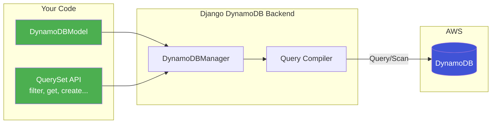

# Django ORM & Admin Compatibility Guide

This document details the Django ORM and Admin features supported by the DynamoDB backend, along with known limitations and DynamoDB-specific alternatives.

## How It Works



## QuerySet Methods

### Fully Supported

| Method | Description |
|--------|-------------|
| `filter(**kwargs)` | Filter by field values using DynamoDB conditions |
| `exclude(**kwargs)` | Exclude items matching conditions |
| `get(**kwargs)` | Retrieve a single item |
| `all()` | Return all items (performs table scan) |
| `none()` | Return empty queryset |
| `count()` | Count matching items |
| `exists()` | Check if any items match |
| `first()` | Get first item |
| `last()` | Get last item |
| `order_by(*fields)` | Sort results (in-memory for non-index fields) |
| `reverse()` | Reverse the ordering |
| `values(*fields)` | Return dictionaries instead of model instances |
| `values_list(*fields)` | Return tuples of field values |
| `only(*fields)` | Load only specified fields (projection) |
| `defer(*fields)` | Defer loading of specified fields |
| `iterator()` | Iterate without caching |
| `create(**kwargs)` | Create and save a new instance |
| `bulk_create(objs)` | Create multiple instances efficiently (25-item batches) |
| `bulk_update(objs, fields)` | Update multiple instances efficiently |
| `get_or_create(**kwargs)` | Get existing or create new instance |
| `update_or_create(**kwargs)` | Update existing or create new instance |
| `in_bulk(id_list)` | Retrieve multiple items by primary key |
| `update(**kwargs)` | Update matching items |
| `delete()` | Delete matching items |
| `latest(field)` | Get item with latest value for field |
| `earliest(field)` | Get item with earliest value for field |

### Supported with Limitations

| Method | Limitation |
|--------|------------|
| `distinct()` | In-memory deduplication only |
| `annotate()` | Limited annotation support |
| `aggregate()` | See Aggregation section below |
| `select_related()` | No-op (DynamoDB has no joins) |
| `prefetch_related()` | No-op (DynamoDB has no joins) |

### Not Supported

| Method | Reason |
|--------|--------|
| `raw()` | No SQL support |
| `extra()` | No SQL support |
| `using()` | Single database only |
| `union()` | No SQL UNION equivalent |
| `intersection()` | No SQL INTERSECT equivalent |
| `difference()` | No SQL EXCEPT equivalent |

## Filter Lookups

### Fully Supported

| Lookup | Example |
|--------|---------|
| `exact` | `filter(name='John')` |
| `iexact` | `filter(name__iexact='john')` (case-insensitive) |
| `contains` | `filter(name__contains='oh')` |
| `icontains` | `filter(name__icontains='OH')` |
| `startswith` | `filter(name__startswith='Jo')` |
| `istartswith` | `filter(name__istartswith='jo')` |
| `endswith` | `filter(name__endswith='hn')` |
| `iendswith` | `filter(name__iendswith='HN')` |
| `in` | `filter(status__in=['active', 'pending'])` |
| `gt` | `filter(age__gt=18)` |
| `gte` | `filter(age__gte=18)` |
| `lt` | `filter(age__lt=65)` |
| `lte` | `filter(age__lte=65)` |
| `range` | `filter(age__range=(18, 65))` |
| `isnull` | `filter(email__isnull=True)` |

### Supported with DynamoDB Mapping

| Lookup | DynamoDB Implementation |
|--------|------------------------|
| `between` | Maps to DynamoDB `between()` condition |
| `begins_with` | Maps to DynamoDB `begins_with()` condition |

### Not Supported

| Lookup | Reason |
|--------|--------|
| `regex` | No regex support in DynamoDB |
| `iregex` | No regex support in DynamoDB |
| `date` | Use range queries instead |
| `year`, `month`, `day` | Use range queries instead |

## Q Objects

### Fully Supported

```python
from django.db.models import Q

# AND queries (default)
Model.objects.filter(Q(status='active') & Q(type='premium'))

# OR queries
Model.objects.filter(Q(status='active') | Q(type='premium'))

# NOT queries (negation)
Model.objects.filter(~Q(status='deleted'))

# Complex combinations
Model.objects.filter(
    (Q(status='active') | Q(type='premium')) & ~Q(archived=True)
)

# Exclude with Q objects
Model.objects.exclude(Q(status='deleted') | Q(archived=True))
```

## Aggregation

### Supported Aggregations

```python
from django.db.models import Count, Sum, Avg, Min, Max

# Count
Model.objects.aggregate(Count('id'))  # {'id__count': 42}

# Sum
Model.objects.aggregate(Sum('amount'))  # {'amount__sum': 1500.00}

# Average
Model.objects.aggregate(Avg('rating'))  # {'rating__avg': 4.2}

# Min/Max
Model.objects.aggregate(Min('created_at'), Max('created_at'))

# Multiple aggregations
Model.objects.aggregate(
    total=Sum('amount'),
    average=Avg('amount'),
    count=Count('id')
)
```

**Note:** Aggregations are computed in-memory after fetching matching items. For large datasets, consider using DynamoDB-native features or pre-computed values.

## F() Expressions

The standard Django `F()` expression is not directly supported. Instead, use `DynamoDBF` for atomic operations:

### DynamoDBF - Atomic Increment/Decrement

```python
from django_dynamodb_backend import DynamoDBF

# Atomic increment (uses DynamoDB ADD operation)
Model.objects.filter(pk=1).update(view_count=DynamoDBF('view_count') + 1)

# Atomic decrement
Model.objects.filter(pk=1).update(stock=DynamoDBF('stock') - 5)

# Check if operation is atomic
f_expr = DynamoDBF('counter') + 10
f_expr.is_atomic  # True (property, not a method call)

# Get DynamoDB update expression components
update_expr, attr_names, attr_values = f_expr.get_update_expression()
# update_expr: 'SET #counter = #counter + :delta'
# attr_names: {'#counter': 'counter'}
# attr_values: {':delta': Decimal('10')}
```

### Non-Atomic Operations

Multiply and divide are supported but NOT atomic (require read-modify-write):

```python
# WARNING: These are NOT atomic!
f_expr = DynamoDBF('price') * 1.1  # 10% increase
f_expr.is_atomic  # False - logged as warning

# For non-atomic operations, apply manually:
instance = Model.objects.get(pk=1)
new_value = f_expr.apply_to_instance(instance)
instance.price = new_value
instance.save()
```

## Django Admin Integration

### Supported Features

| Feature | Implementation |
|---------|---------------|
| `list_display` | Full support |
| `list_filter` | Full support |
| `search_fields` | Full support |
| `ordering` | Full support |
| `readonly_fields` | Full support |
| `list_per_page` | Full support |
| `date_hierarchy` | Custom implementation via `DynamoDBDateHierarchyMixin` |
| `actions` | Full support |

### DynamoDB Admin Base Class

```python
from django_dynamodb_backend.admin import DynamoDBAdmin

@admin.register(MyModel)
class MyModelAdmin(DynamoDBAdmin):
    list_display = ['name', 'status', 'created_at']
    list_filter = ['status']
    search_fields = ['name']
    date_hierarchy = 'created_at'  # Works with DynamoDB!
    
    # Optional: Specify custom DynamoDB table name
    class Meta:
        db_table = 'my-custom-table'
```

### Date Hierarchy Support

The `DynamoDBDateHierarchyMixin` provides date-based navigation:

```python
from django_dynamodb_backend.admin import DynamoDBDateHierarchyMixin

class MyModelAdmin(DynamoDBDateHierarchyMixin, admin.ModelAdmin):
    date_hierarchy = 'pub_date'
    
    # Internally uses efficient range queries:
    # - Year level: pub_date >= 2024-01-01 AND pub_date < 2025-01-01
    # - Month level: pub_date >= 2024-03-01 AND pub_date < 2024-04-01
    # - Day level: pub_date >= 2024-03-15 AND pub_date < 2024-03-16
```

### Admin Logging

Admin actions are automatically logged:

```python
from django_dynamodb_backend.admin import DynamoDBAdminLoggingMixin

class MyModelAdmin(DynamoDBAdminLoggingMixin, admin.ModelAdmin):
    pass

# Logs to Python logging and attempts to write Django's LogEntry:
# - log_addition(): Records object creation
# - log_change(): Records object modification  
# - log_deletion(): Records object deletion
#
# In DynamoDB-only mode, LogEntry writes are silently skipped
# (no relational database). Use Python logging or CloudWatch
# for audit trails.
```

## Model Definition

### DynamoDBModel Base Class

```python
from django_dynamodb_backend import DynamoDBModel, DynamoDBManager

class MyModel(DynamoDBModel):
    id = models.CharField(max_length=36, primary_key=True, default=uuid.uuid4)
    name = models.CharField(max_length=255)
    status = models.CharField(max_length=50)
    created_at = models.DateTimeField(auto_now_add=True)
    
    # objects = DynamoDBManager() is inherited from DynamoDBModel
    
    class Meta:
        # Optional: Specify custom table name
        db_table = 'my_dynamo_table'
```

### Supported Field Types

| Django Field | DynamoDB Type |
|-------------|---------------|
| `CharField` | String (S) |
| `TextField` | String (S) |
| `EmailField` | String (S) |
| `URLField` | String (S) |
| `SlugField` | String (S) |
| `IntegerField` | Number (N) |
| `FloatField` | Number (N) |
| `DecimalField` | Number (N) — stored as float; see note |
| `BooleanField` | Boolean (BOOL) |
| `DateField` | String (S) - ISO format |
| `DateTimeField` | String (S) - ISO format |
| `JSONField` | Map (M) or List (L) |
| `UUIDField` | String (S) |

> **DecimalField precision:** Values are converted to `float` for DynamoDB storage, which may lose precision for values requiring exact decimal representation (e.g. currency). If exact precision is critical, consider storing values as strings and converting in application code.

## Performance Considerations

### Query vs Scan

- **Query** (fast): Used when filtering by partition key
- **Scan** (slow): Used when partition key is not in filter

```python
# Uses Query (efficient) - assuming 'user_id' is partition key
MyModel.objects.filter(user_id='123', created_at__gte=today)

# Uses Scan (less efficient) - no partition key
MyModel.objects.filter(status='active')
```

### Batch Operations

```python
# Efficient: Uses BatchWriteItem (25-item batches)
MyModel.objects.bulk_create([obj1, obj2, ...])

# Efficient: Uses BatchGetItem
MyModel.objects.in_bulk(['id1', 'id2', 'id3'])
```

### Pagination

```python
# DynamoDB has a 1MB response limit
# Use iterator() for large result sets
for item in MyModel.objects.filter(status='active').iterator():
    process(item)
```

## Migration Support

Migrations are supported but work differently than SQL migrations:

- **CreateModel**: Creates DynamoDB table with specified indexes
- **AddField**: Adds attribute (no schema change needed in DynamoDB)
- **RemoveField**: No-op (DynamoDB is schemaless)
- **AlterField**: Updates local metadata only
- **AddIndex**: Creates Global Secondary Index (GSI)
- **RemoveIndex**: Removes GSI

```python
# Example migration
class Migration(migrations.Migration):
    operations = [
        migrations.CreateModel(
            name='MyModel',
            fields=[...],
            options={
                'indexes': [
                    models.Index(fields=['status', 'created_at'], name='status_created_idx'),
                ],
            },
        ),
    ]
```

## Error Handling

```python
from django.core.exceptions import ObjectDoesNotExist, MultipleObjectsReturned
from botocore.exceptions import ClientError

try:
    obj = MyModel.objects.get(pk='non-existent')
except MyModel.DoesNotExist:
    # Handle missing object
    pass

try:
    MyModel.objects.bulk_create(items)
except ClientError as e:
    if e.response['Error']['Code'] == 'ProvisionedThroughputExceededException':
        # Handle throttling
        pass
```

## Feature Compatibility Matrix

| Feature | Status | Notes |
|---------|--------|-------|
| CRUD Operations | ✅ Full | Create, Read, Update, Delete |
| Filtering | ✅ Full | All standard lookups |
| Q Objects | ✅ Full | AND, OR, NOT |
| Aggregation | ⚠️ Partial | In-memory computation |
| F() Expressions | ⚠️ Partial | Use DynamoDBF for atomic ops |
| Transactions | ⚠️ Partial | DynamoDB transactions differ |
| Joins | ❌ None | NoSQL limitation |
| Raw SQL | ❌ None | NoSQL limitation |
| Full-text Search | ❌ None | Consider OpenSearch |
| Foreign Keys | ❌ None | Use string references |
| Many-to-Many | ❌ None | Use list fields or separate table |

## Troubleshooting

### Common Issues

1. **"No partition key in query"**: Add partition key to filter or accept scan performance
2. **"Throughput exceeded"**: Implement retry logic or increase table capacity
3. **"Item size > 400KB"**: Split large items or use S3 for large data
4. **"Aggregation slow"**: Pre-compute aggregates or use smaller datasets

### Debug Mode

```python
# Enable DynamoDB query logging
import logging
logging.getLogger('django_dynamodb_backend').setLevel(logging.DEBUG)
```

## DynamoDB-Only Deployment

This backend supports running Django **exclusively on DynamoDB** without any relational database. This is ideal for serverless deployments on AWS Lambda, keeping everything within free tier.

### What's Included

| Component | DynamoDB Implementation |
|-----------|------------------------|
| Sessions | `django_dynamodb_backend.sessions.SessionStore` with TTL |
| Users | `django_dynamodb_backend.contrib.auth_dynamo.DynamoUser` |
| Authentication | `django_dynamodb_backend.contrib.auth_dynamo.backends.DynamoAuthBackend` |
| Admin | Works with DynamoUser via GSIs on username/email |

### Configuration

```python
# settings.py

INSTALLED_APPS = [
    'django.contrib.admin',
    'django.contrib.auth',  # Required for admin
    'django.contrib.contenttypes',
    'django.contrib.sessions',  # Required for session middleware
    'django.contrib.messages',
    'django.contrib.staticfiles',
    # DynamoDB integration
    'django_dynamodb_backend',
    'django_dynamodb_backend.contrib.auth_dynamo',
]

# Database
DATABASES = {
    'default': {
        'ENGINE': 'django_dynamodb_backend.db',
        'NAME': 'my_app',
        'OPTIONS': {
            'region_name': 'us-east-1',
            # For local development with LocalStack:
            'endpoint_url': 'http://localhost:4566',
            'aws_access_key_id': 'test',
            'aws_secret_access_key': 'test',
        },
    }
}

# Sessions - DynamoDB with TTL
SESSION_ENGINE = 'django_dynamodb_backend.sessions'
DYNAMODB_SESSION_TABLE_NAME = 'django_sessions'

# Authentication - DynamoDB users
AUTH_USER_MODEL = 'auth_dynamo.DynamoUser'
DYNAMODB_USER_TABLE_NAME = 'django_users'
AUTHENTICATION_BACKENDS = [
    'django_dynamodb_backend.contrib.auth_dynamo.backends.DynamoAuthBackend',
]

# Cache - local memory (or use DynamoDB/ElastiCache)
CACHES = {
    'default': {
        'BACKEND': 'django.core.cache.backends.locmem.LocMemCache',
    }
}
```

### Table Setup

Create the required DynamoDB tables:

```bash
# Create sessions table (with TTL)
python manage.py dynamodb_create_session_table

# Create users table (with GSIs) and admin user
python manage.py dynamodb_create_user_table --create-admin

# Create app-specific tables
python manage.py dynamodb_migrate
```

### DynamoDB Table Schemas

```mermaid
erDiagram
    django_sessions {
        string session_key PK
        string session_data
        number expire_date "TTL"
    }
    
    django_users {
        string id PK
        string username "GSI"
        string email "GSI"
        string password
        string first_name
        string last_name
        boolean is_active
        boolean is_staff
        boolean is_superuser
        string date_joined
        string last_login
    }
    
    your_app_table {
        string id PK
        string sort_key SK
        string your_fields "..."
    }
```

**django_sessions**
- Partition Key: `session_key` (String)
- TTL Attribute: `expire_date` (Unix timestamp)
- Billing: Pay-per-request

**django_users**
- Partition Key: `id` (String, UUID)
- GSI `username-index`: Partition Key = `username`
- GSI `email-index`: Partition Key = `email`
- Billing: Pay-per-request

### Cost Optimization

Using Pay-per-request billing mode keeps costs minimal for low-traffic apps:
- No provisioned capacity charges
- Pay only for actual reads/writes
- Typically fits within AWS free tier for development

### Limitations

1. **No SQL migrations**: Don't run `migrate` for auth/sessions tables
2. **Groups**: Basic string-based implementation (no full Group model)
3. **Permissions**: Stored as comma-separated strings, not FK relationships
4. **Admin logs**: LogEntry writes are silently skipped; use Python logging or CloudWatch

---

## FAQ & Gotchas

### What does `migrate` do?

Django's built-in `migrate` command does nothing for DynamoDB tables. Use the
DynamoDB-specific management commands instead:

```bash
python manage.py dynamodb_create_session_table
python manage.py dynamodb_create_user_table
python manage.py dynamodb_migrate        # app-specific tables
```

If you're running in **Hybrid Mode** (DynamoDB + SQLite/PostgreSQL), you may
still need `migrate` for the relational side (e.g. `contenttypes`).

### Do I need `django.contrib.contenttypes`?

Yes — Django admin requires it. The backend provides a no-op database engine
so `migrate contenttypes` works without a relational database. In pure-DynamoDB
mode, the contenttypes table is created in an in-memory SQLite store.

### What about admin log entries (`LogEntry`)?

Django's `LogEntry` model expects a relational database. In DynamoDB-only mode
admin log entries are silently skipped. You'll want to rely on CloudWatch or
Python `logging` for audit trails in production.

### Will third-party apps work?

It depends. Any app that:

- Uses `models.Model` with ForeignKey / ManyToManyField may not work.
- Relies on SQL `raw()`, `extra()`, or database-level constraints will not work.
- Uses the standard `User` model will need to be pointed at `DynamoUser` via
  `AUTH_USER_MODEL`.

Apps that only read `request.user` or use `django.contrib.auth` permission
checks should work without changes.

### How do I handle M2M relationships?

DynamoDB has no native join support. Instead of `ManyToManyField`, store
related IDs in a `JSONField(default=list)` and manage the relationship in
application code. See the Migration Tutorial for examples.

### Is there a performance penalty for `order_by()`?

Sorting is performed in-memory after fetching results. For small result sets
this is fine. For large datasets, consider using a DynamoDB sort key or a GSI
whose sort key matches your ordering.

---

## Related Documentation

| Document | When to read |
|----------|-------------|
| [Documentation Index](INDEX.md) | Find the right doc for any task |
| [Migration Tutorial](MIGRATION_TUTORIAL.md) | Step-by-step guide for migrating projects |
| [API Reference](API_REFERENCE.md) | Complete API documentation |
| [Deployment Guide](DEPLOYMENT_GUIDE.md) | Production deployment instructions |
| [Feature Walkthrough](FEATURE_WALKTHROUGH.md) | Deep-dive into all features |
