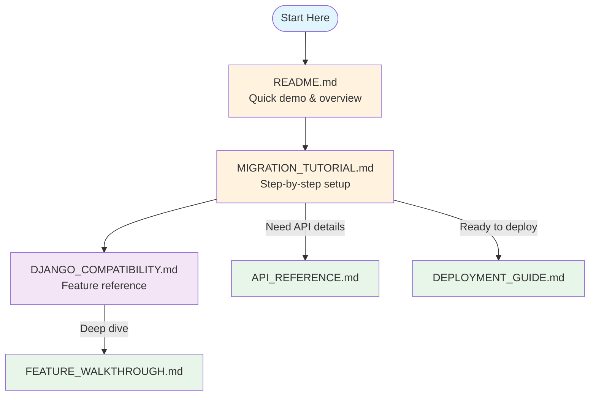
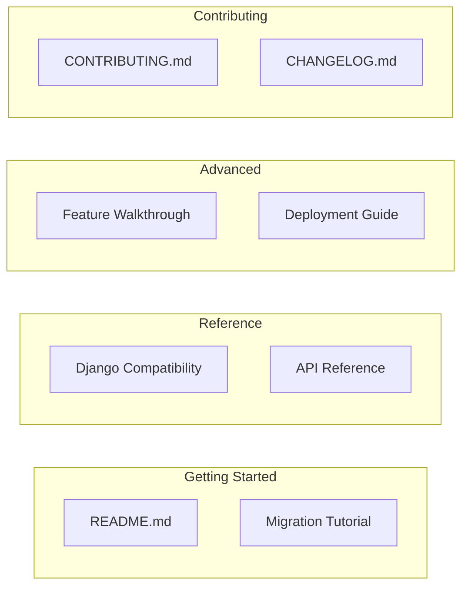

# Django DynamoDB Backend Documentation

Welcome! This index helps you find the right documentation for your needs.

## 🚀 Getting Started

| What do you want to do? | Start here |
|------------------------|------------|
| **Try it out quickly** | Run `make demo` → [README Quick Start](../README.md#quick-start) |
| **Migrate an existing Django project** | [Migration Tutorial](MIGRATION_TUTORIAL.md) |
| **Start a new project with DynamoDB** | [Migration Tutorial → Step 3](MIGRATION_TUTORIAL.md#step-3-configure-settings) |
| **Deploy to production/Lambda** | [Deployment Guide](DEPLOYMENT_GUIDE.md) |

## 📚 Documentation Map

### Reading Flow for New Users



### All Documentation at a Glance



---

## 📖 Document Summaries

### [README.md](../README.md)
**Purpose:** Project overview and quick start  
**Read this to:** Understand what the project does, try the demo, see basic examples  
**Time:** 5 minutes

### [Migration Tutorial](MIGRATION_TUTORIAL.md)
**Purpose:** Step-by-step guide for migrating existing Django projects  
**Read this to:** Convert your Django app to use DynamoDB  
**Time:** 30-60 minutes (including implementation)  
**Prerequisites:** Django experience

### [Django Compatibility Guide](DJANGO_COMPATIBILITY.md)
**Purpose:** Reference for Django ORM feature support  
**Read this to:** Check if a specific Django feature works, understand limitations  
**Time:** Reference document (scan as needed)

### [API Reference](API_REFERENCE.md)
**Purpose:** Complete API documentation  
**Read this to:** Look up method signatures, parameters, return types  
**Time:** Reference document (search as needed)

### [Feature Walkthrough](FEATURE_WALKTHROUGH.md)
**Purpose:** Deep-dive into all features with examples  
**Read this to:** Learn advanced features, optimize performance, customize admin  
**Time:** 30-60 minutes (or skim specific sections)

### [Deployment Guide](DEPLOYMENT_GUIDE.md)
**Purpose:** Production deployment instructions  
**Read this to:** Deploy to AWS Lambda, EC2, ECS, or Docker  
**Time:** 15-30 minutes per deployment type

### [Contributing Guide](../CONTRIBUTING.md)
**Purpose:** Development and contribution guidelines  
**Read this to:** Set up development environment, contribute code  
**Time:** 10 minutes

### [Changelog](../CHANGELOG.md)
**Purpose:** Version history and breaking changes  
**Read this to:** See what changed, migrate between versions  
**Time:** Scan as needed

---

## 🔍 Quick Reference

### Common Tasks

| Task | Document | Section |
|------|----------|---------|
| Run the demo | [README](../README.md) | Quick Start |
| Configure settings.py | [Migration Tutorial](MIGRATION_TUTORIAL.md) | Step 3 |
| Convert a model | [Migration Tutorial](MIGRATION_TUTORIAL.md) | Step 4 |
| Convert admin class | [Migration Tutorial](MIGRATION_TUTORIAL.md) | Step 5 |
| Create DynamoDB tables | [Migration Tutorial](MIGRATION_TUTORIAL.md) | Step 6 |
| Check if a QuerySet method works | [Django Compatibility](DJANGO_COMPATIBILITY.md) | QuerySet Methods |
| Use Q objects | [Django Compatibility](DJANGO_COMPATIBILITY.md) | Q Objects |
| Configure sessions | [API Reference](API_REFERENCE.md) | Sessions |
| Configure authentication | [API Reference](API_REFERENCE.md) | Authentication |
| Deploy to Lambda | [Deployment Guide](DEPLOYMENT_GUIDE.md) | Serverless Deployment |
| Optimize queries with GSI | [Feature Walkthrough](FEATURE_WALKTHROUGH.md) | GSI Optimization |
| Set up local development | [Deployment Guide](DEPLOYMENT_GUIDE.md) | Development Setup |
| Run tests | [Contributing](../CONTRIBUTING.md) | Testing |

### Management Commands

| Command | Purpose | Docs |
|---------|---------|------|
| `dynamodb_create_session_table` | Create sessions table | [API Reference](API_REFERENCE.md#management-commands) |
| `dynamodb_create_user_table` | Create users table | [API Reference](API_REFERENCE.md#management-commands) |
| `dynamodb_createsuperuser` | Create a superuser interactively | [API Reference](API_REFERENCE.md#management-commands) |
| `dynamodb_migrate` | Apply migrations | [API Reference](API_REFERENCE.md#management-commands) |
| `dynamodb_makemigrations` | Create migrations | [API Reference](API_REFERENCE.md#management-commands) |
| `dynamodb_showmigrations` | Show migration status | [API Reference](API_REFERENCE.md#management-commands) |
| `dynamodb_rollback` | Rollback migrations | [API Reference](API_REFERENCE.md#management-commands) |

### Key Settings

| Setting | Purpose | Docs |
|---------|---------|------|
| `SESSION_ENGINE` | DynamoDB sessions | [Migration Tutorial](MIGRATION_TUTORIAL.md#33-configure-sessions) |
| `AUTH_USER_MODEL` | DynamoDB users | [Migration Tutorial](MIGRATION_TUTORIAL.md#34-configure-authentication) |
| `AUTHENTICATION_BACKENDS` | Auth backend | [Migration Tutorial](MIGRATION_TUTORIAL.md#34-configure-authentication) |
| `DYNAMODB_SESSION_TABLE_NAME` | Sessions table name | [API Reference](API_REFERENCE.md#sessions) |
| `DYNAMODB_USER_TABLE_NAME` | Users table name | [API Reference](API_REFERENCE.md#authentication-auth_dynamo) |

---

## ❓ FAQ

### "I just want to try this out"
Run `make demo` and visit http://localhost:8001/admin/ (admin/admin123).  
If running `local-dev` instead, the URL is http://localhost:8000/admin/.

### "I have an existing Django project"
Start with the [Migration Tutorial](MIGRATION_TUTORIAL.md) — it walks you through everything.

### "Does feature X work?"
Check the [Django Compatibility Guide](DJANGO_COMPATIBILITY.md) for a complete list of supported features.

### "How do I deploy to AWS Lambda?"
See [Deployment Guide → Serverless Deployment](DEPLOYMENT_GUIDE.md#serverless-deployment-aws-lambda)

### "Something isn't working"
Check [Migration Tutorial → Troubleshooting](MIGRATION_TUTORIAL.md#troubleshooting) first, then open a GitHub issue.

---

## 📁 File Locations

```
django-dynamodb-backend/
├── README.md                    # Start here
├── CONTRIBUTING.md              # For contributors
├── CHANGELOG.md                 # Version history
│
├── docs/
│   ├── INDEX.md                 # You are here
│   ├── MIGRATION_TUTORIAL.md    # Step-by-step migration guide
│   ├── DJANGO_COMPATIBILITY.md  # ORM feature support
│   ├── API_REFERENCE.md         # Complete API docs
│   ├── FEATURE_WALKTHROUGH.md   # Detailed feature guide
│   └── DEPLOYMENT_GUIDE.md      # Production deployment
│
├── examples/
│   └── demo_project/            # Working demo application
│
└── src/
    └── django_dynamodb_backend/ # The actual package
```
