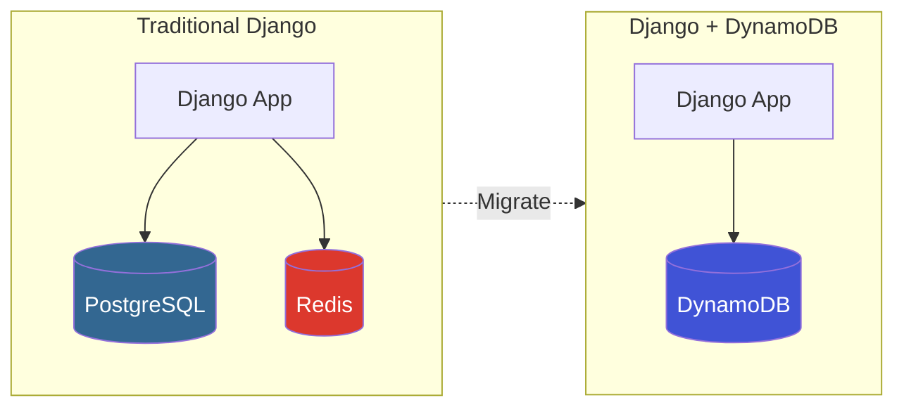
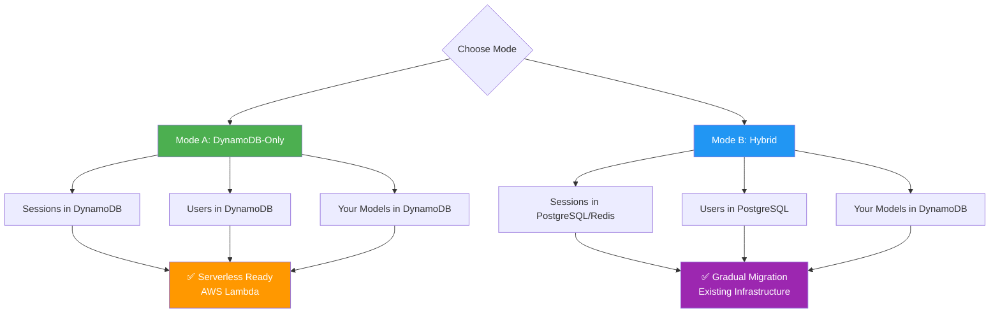
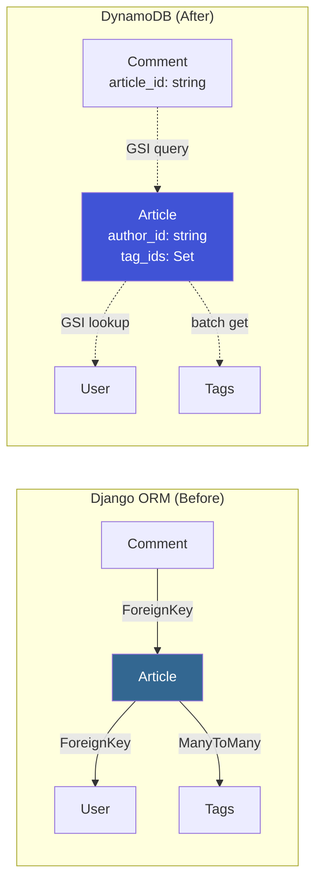

# Migrating Your Django Project to DynamoDB

A step-by-step guide for experienced Django developers to run existing projects on DynamoDB.

> **Prerequisites:** This tutorial assumes familiarity with Django. If you're new to Django, complete the [official Django tutorial](https://docs.djangoproject.com/en/stable/intro/tutorial01/) first.

## Table of Contents

1. [Overview](#overview)
2. [Step 1: Install the Backend](#step-1-install-the-backend)
3. [Step 2: Choose Your Mode](#step-2-choose-your-mode)
4. [Step 3: Configure Settings](#step-3-configure-settings)
5. [Step 4: Convert Your Models](#step-4-convert-your-models)
6. [Step 5: Update Admin Classes](#step-5-update-admin-classes)
7. [Step 6: Create Tables](#step-6-create-tables)
8. [Step 7: Migrate Your Data](#step-7-migrate-your-data)
9. [Common Patterns](#common-patterns)
10. [Troubleshooting](#troubleshooting)

---

## Overview

### Architecture: Before and After



### What Changes, What Stays the Same

| Stays the Same | Changes |
|----------------|---------|
| Django views, templates, forms | Model base class |
| URL routing | Some field types |
| Middleware | Admin base class |
| Most QuerySet methods | No ForeignKey/ManyToMany |
| Django admin UI | Table creation commands |

### Time Estimate

| Project Size | Estimated Time |
|-------------|----------------|
| Small (1-3 models) | 30 minutes |
| Medium (5-10 models) | 1-2 hours |
| Large (10+ models) | 2-4 hours |

---

## Step 1: Install the Backend

### From Source (Not Yet on PyPI)

```bash
git clone https://github.com/jpwhite3/django-dynamodb-backend.git
cd django-dynamodb-backend
pip install -e .
```

> **Note:** This package is not yet published to PyPI. Install from source as shown above.

### Install Dependencies

```bash
pip install boto3 pynamodb
```

### Start Local DynamoDB

For development, use LocalStack:

```bash
docker run -d -p 4566:4566 localstack/localstack
```

Or DynamoDB Local:

```bash
docker run -d -p 8000:8000 amazon/dynamodb-local
```

---

## Step 2: Choose Your Mode



### Mode A: DynamoDB-Only (Recommended)

Everything runs on DynamoDB — sessions, users, your models. Ideal for:
- Serverless deployments (AWS Lambda)
- New projects
- Eliminating database management

### Mode B: Hybrid

Your models use DynamoDB, but Django's built-in apps (auth, sessions) use SQLite/PostgreSQL. Ideal for:
- Gradual migrations
- Projects with complex user permissions
- When you need Django's full Group/Permission models

**This tutorial covers Mode A (DynamoDB-Only).** For hybrid mode, skip the sessions and auth configuration in Steps 3.3 and 3.4 — keep Django's default `SESSION_ENGINE` and `AUTH_USER_MODEL`, and omit `django_dynamodb_backend.contrib.auth_dynamo` from `INSTALLED_APPS`. Your DynamoDB models will still work alongside a relational database for Django's built-in apps.

---

## Step 3: Configure Settings

### 3.1 Update INSTALLED_APPS

```python
# settings.py

INSTALLED_APPS = [
    'django.contrib.admin',
    'django.contrib.auth',           # Still needed for admin
    'django.contrib.contenttypes',
    'django.contrib.sessions',       # Still needed for middleware
    'django.contrib.messages',
    'django.contrib.staticfiles',
    
    # Add DynamoDB backend
    'django_dynamodb_backend',
    'django_dynamodb_backend.contrib.auth_dynamo',  # DynamoDB users
    
    # Your apps
    'myapp',
]
```

### 3.2 Configure Database

```python
# settings.py

DATABASES = {
    'default': {
        'ENGINE': 'django_dynamodb_backend.db',
        'NAME': 'my_project',
        'OPTIONS': {
            'region_name': 'us-east-1',
            # For local development:
            'endpoint_url': 'http://localhost:4566',  # LocalStack
            'aws_access_key_id': 'test',
            'aws_secret_access_key': 'test',
        },
    }
}
```

### 3.3 Configure Sessions

```python
# settings.py

# Use DynamoDB for sessions (no Redis needed!)
SESSION_ENGINE = 'django_dynamodb_backend.sessions'
DYNAMODB_SESSION_TABLE_NAME = 'django_sessions'
```

### 3.4 Configure Authentication

```python
# settings.py

# Use DynamoDB for users
AUTH_USER_MODEL = 'auth_dynamo.DynamoUser'
DYNAMODB_USER_TABLE_NAME = 'django_users'

AUTHENTICATION_BACKENDS = [
    'django_dynamodb_backend.contrib.auth_dynamo.backends.DynamoAuthBackend',
]
```

### 3.5 Optional: Configure Cache

```python
# settings.py

# Local memory cache works fine for most cases
CACHES = {
    'default': {
        'BACKEND': 'django.core.cache.backends.locmem.LocMemCache',
    }
}
```

### Complete Settings Example

```python
# settings.py
import os

SECRET_KEY = os.environ.get('DJANGO_SECRET_KEY', 'dev-secret-key')
DEBUG = True
ALLOWED_HOSTS = ['*']

INSTALLED_APPS = [
    'django.contrib.admin',
    'django.contrib.auth',
    'django.contrib.contenttypes',
    'django.contrib.sessions',
    'django.contrib.messages',
    'django.contrib.staticfiles',
    'django_dynamodb_backend',
    'django_dynamodb_backend.contrib.auth_dynamo',
    'myapp',
]

MIDDLEWARE = [
    'django.middleware.security.SecurityMiddleware',
    'django.contrib.sessions.middleware.SessionMiddleware',
    'django.middleware.common.CommonMiddleware',
    'django.middleware.csrf.CsrfViewMiddleware',
    'django.contrib.auth.middleware.AuthenticationMiddleware',
    'django.contrib.messages.middleware.MessageMiddleware',
    'django.middleware.clickjacking.XFrameOptionsMiddleware',
]

ROOT_URLCONF = 'myproject.urls'

DATABASES = {
    'default': {
        'ENGINE': 'django_dynamodb_backend.db',
        'NAME': 'myproject',
        'OPTIONS': {
            'region_name': 'us-east-1',
            'endpoint_url': os.environ.get('DYNAMODB_ENDPOINT', 'http://localhost:4566'),
            'aws_access_key_id': os.environ.get('AWS_ACCESS_KEY_ID', 'test'),
            'aws_secret_access_key': os.environ.get('AWS_SECRET_ACCESS_KEY', 'test'),
        },
    }
}

SESSION_ENGINE = 'django_dynamodb_backend.sessions'
DYNAMODB_SESSION_TABLE_NAME = 'django_sessions'

AUTH_USER_MODEL = 'auth_dynamo.DynamoUser'
DYNAMODB_USER_TABLE_NAME = 'django_users'
AUTHENTICATION_BACKENDS = [
    'django_dynamodb_backend.contrib.auth_dynamo.backends.DynamoAuthBackend',
]

CACHES = {
    'default': {
        'BACKEND': 'django.core.cache.backends.locmem.LocMemCache',
    }
}

TEMPLATES = [
    {
        'BACKEND': 'django.template.backends.django.DjangoTemplates',
        'DIRS': [],
        'APP_DIRS': True,
        'OPTIONS': {
            'context_processors': [
                'django.template.context_processors.debug',
                'django.template.context_processors.request',
                'django.contrib.auth.context_processors.auth',
                'django.contrib.messages.context_processors.messages',
            ],
        },
    },
]

STATIC_URL = '/static/'
DEFAULT_AUTO_FIELD = 'django.db.models.BigAutoField'
```

---

## Step 4: Convert Your Models

### Before (Standard Django Model)

```python
# models.py (before)
from django.db import models

class Article(models.Model):
    title = models.CharField(max_length=200)
    content = models.TextField()
    author = models.ForeignKey('auth.User', on_delete=models.CASCADE)
    category = models.ForeignKey('Category', on_delete=models.SET_NULL, null=True)
    tags = models.ManyToManyField('Tag')
    published = models.BooleanField(default=False)
    view_count = models.IntegerField(default=0)
    created_at = models.DateTimeField(auto_now_add=True)
    updated_at = models.DateTimeField(auto_now=True)
    
    class Meta:
        ordering = ['-created_at']
```

### After (DynamoDB Model)

```python
# models.py (after)
from django.db import models
from django_dynamodb_backend.models import DynamoDBModel

class Article(DynamoDBModel):
    # Primary key (required - DynamoDB needs explicit PK)
    id = models.CharField(max_length=36, primary_key=True)
    
    # Same Django field types
    title = models.CharField(max_length=200)
    content = models.TextField()
    
    # ForeignKey becomes a string reference
    author_id = models.CharField(max_length=36)  # Store user ID
    category_id = models.CharField(max_length=36, null=True, blank=True)
    
    # ManyToMany becomes a JSONField or comma-separated TextField
    tags = models.JSONField(default=list)  # Store tag IDs as a list
    
    # These work the same
    published = models.BooleanField(default=False)
    view_count = models.IntegerField(default=0)
    created_at = models.DateTimeField(auto_now_add=True)
    updated_at = models.DateTimeField(auto_now=True)
    
    class Meta:
        db_table = 'articles'  # Explicit table name
        
        # Optional: Define GSIs for efficient queries.
        # Note: These are used by the migration system (dynamodb_makemigrations)
        # to generate CreateTable operations with the specified indexes.
        global_secondary_indexes = [
            {
                'index_name': 'author-date-index',
                'partition_key': 'author_id',
                'sort_key': 'created_at',
                'projection_type': 'ALL',
            },
            {
                'index_name': 'published-date-index',
                'partition_key': 'published',
                'sort_key': 'created_at',
                'projection_type': 'ALL',
            },
        ]
    
    def __str__(self):
        return self.title
```

### Key Differences

| Django ORM | DynamoDB Backend | Notes |
|------------|------------------|-------|
| `models.Model` | `DynamoDBModel` | Base class |
| Auto `id` field | Explicit `id = CharField(primary_key=True)` | Must define PK |
| `ForeignKey` | `CharField` storing ID | No joins in DynamoDB |
| `ManyToManyField` | `JSONField` (list) or separate table | Store IDs in a list |
| `ordering` in Meta | Manual ordering or GSI | Use GSI for sort |
| `db_table` | `db_table` | Same Meta option, used by both |

### Field Type Mapping

`DynamoDBModel` uses standard Django field types — no special imports needed:

```python
# Use standard django.db.models fields
from django.db import models

models.CharField      # → DynamoDB String (S)
models.TextField      # → DynamoDB String (S)
models.EmailField     # → DynamoDB String (S)
models.URLField       # → DynamoDB String (S)
models.SlugField      # → DynamoDB String (S)
models.IntegerField   # → DynamoDB Number (N)
models.FloatField     # → DynamoDB Number (N)
models.DecimalField   # → DynamoDB Number (N) — stored as float
models.BooleanField   # → DynamoDB Boolean (BOOL)
models.DateTimeField  # → DynamoDB String (S) / UTCDateTime
models.DateField      # → DynamoDB String (S) ISO format
models.JSONField      # → DynamoDB Map (M) or List (L)
models.UUIDField      # → DynamoDB String (S)
```

### Handling Relationships



#### One-to-Many (ForeignKey replacement)

```python
# Before
class Comment(models.Model):
    article = models.ForeignKey(Article, on_delete=models.CASCADE)
    content = models.TextField()

# After
class Comment(DynamoDBModel):
    id = models.CharField(max_length=36, primary_key=True)
    article_id = models.CharField(max_length=36)  # Store the article ID
    content = models.TextField()
    
    class Meta:
        db_table = 'comments'
        global_secondary_indexes = [
            {
                'index_name': 'article-index',
                'partition_key': 'article_id',
                'projection_type': 'ALL',
            },
        ]
    
    # Helper method to get related article
    def get_article(self):
        return Article.objects.get(pk=self.article_id)
```

#### Many-to-Many (Using JSONField)

```python
# Before
class Article(models.Model):
    tags = models.ManyToManyField(Tag)

# After  
class Article(DynamoDBModel):
    # Store tag IDs in a list (DynamoDB List type)
    tag_ids = models.JSONField(default=list)
    
    # Helper methods
    def get_tags(self):
        if not self.tag_ids:
            return []
        return Tag.objects.filter(pk__in=list(self.tag_ids))
    
    def add_tag(self, tag):
        if self.tag_ids is None:
            self.tag_ids = []
        if tag.id not in self.tag_ids:
            self.tag_ids.append(tag.id)
        self.save()
```

---

## Step 5: Update Admin Classes

### Before (Standard Django Admin)

```python
# admin.py (before)
from django.contrib import admin
from .models import Article

@admin.register(Article)
class ArticleAdmin(admin.ModelAdmin):
    list_display = ['title', 'author', 'published', 'created_at']
    list_filter = ['published', 'category']
    search_fields = ['title', 'content']
    date_hierarchy = 'created_at'
```

### After (DynamoDB Admin)

```python
# admin.py (after)
from django.contrib import admin
from django_dynamodb_backend.admin import DynamoDBAdmin
from .models import Article

@admin.register(Article)
class ArticleAdmin(DynamoDBAdmin):
    # These all work the same!
    list_display = ['title', 'author_id', 'published', 'created_at']
    list_filter = ['published', 'category_id']
    search_fields = ['title', 'content']
    
    # Pagination optimized for DynamoDB
    list_per_page = 25
    
    # Fieldsets work normally
    fieldsets = (
        ('Content', {
            'fields': ('title', 'content'),
        }),
        ('Metadata', {
            'fields': ('author_id', 'category_id', 'tags', 'published'),
            'classes': ('collapse',),
        }),
        ('Statistics', {
            'fields': ('view_count', 'created_at', 'updated_at'),
            'classes': ('collapse',),
        }),
    )
    
    readonly_fields = ['created_at', 'updated_at', 'view_count']
```

### Using Inlines

```python
from django_dynamodb_backend.admin_inlines import DynamoDBTabularInline

class CommentInline(DynamoDBTabularInline):
    model = Comment
    fk_name = 'article_id'  # The field linking to parent
    extra = 0
    max_num_items = 10  # DynamoDB batch limit

@admin.register(Article)
class ArticleAdmin(DynamoDBAdmin):
    inlines = [CommentInline]
```

---

## Step 6: Create Tables

### 6.1 Create System Tables

```bash
# Create sessions table (with TTL for auto-expiration)
python manage.py dynamodb_create_session_table

# Create users table (with GSIs for username/email lookup)
python manage.py dynamodb_create_user_table --create-admin

# The --create-admin flag creates: admin / admin123
```

### 6.2 Create App Tables

```bash
# Generate and apply migrations for your models
python manage.py dynamodb_makemigrations myapp
python manage.py dynamodb_migrate
```

### 6.3 Verify Tables

```bash
# List all tables (using AWS CLI with LocalStack)
aws --endpoint-url=http://localhost:4566 dynamodb list-tables

# Should show:
# - django_sessions
# - django_users
# - articles
# - comments
# - etc.
```

---

## Step 7: Migrate Your Data

If you have existing data in PostgreSQL/SQLite, here's how to migrate:

### Simple Migration Script

```python
# migrate_data.py
import os
import django

os.environ.setdefault('DJANGO_SETTINGS_MODULE', 'myproject.settings')
django.setup()

from myapp.models import Article  # DynamoDB model
from legacy_app.models import Article as LegacyArticle  # Old SQL model
import uuid

def migrate_articles():
    for old in LegacyArticle.objects.all():
        Article.objects.create(
            id=str(uuid.uuid4()),
            title=old.title,
            content=old.content,
            author_id=str(old.author_id),
            category_id=str(old.category_id) if old.category_id else None,
            tags=list(old.tags.values_list('id', flat=True)),
            published=old.published,
            view_count=old.view_count,
            created_at=old.created_at,
            updated_at=old.updated_at,
        )
        print(f"Migrated: {old.title}")

if __name__ == '__main__':
    migrate_articles()
```

### Batch Migration for Large Datasets

```python
# migrate_batch.py
from django_dynamodb_backend.models import DynamoDBModel
import uuid

def batch_migrate(old_queryset, new_model_class, transform_func, batch_size=25):
    """
    Migrate data in batches (DynamoDB batch write limit is 25).
    """
    batch = []
    count = 0
    
    for old_obj in old_queryset.iterator():
        new_obj = transform_func(old_obj)
        batch.append(new_obj)
        
        if len(batch) >= batch_size:
            new_model_class.objects.bulk_create(batch)
            count += len(batch)
            print(f"Migrated {count} items...")
            batch = []
    
    # Don't forget the last batch
    if batch:
        new_model_class.objects.bulk_create(batch)
        count += len(batch)
    
    print(f"Migration complete: {count} total items")

# Usage
def transform_article(old):
    from myapp.models import Article
    return Article(
        id=str(uuid.uuid4()),
        title=old.title,
        # ... etc
    )

batch_migrate(
    LegacyArticle.objects.all(),
    Article,
    transform_article
)
```

---

## Common Patterns

### Pattern 1: UUID Primary Keys

```python
import uuid

class MyModel(DynamoDBModel):
    id = models.CharField(max_length=36, primary_key=True, default=lambda: str(uuid.uuid4()))
```

### Pattern 2: Composite Keys (Partition + Sort)

```python
class UserPost(DynamoDBModel):
    user_id = models.CharField(max_length=36, primary_key=True)  # Partition key
    post_id = models.CharField(max_length=36)  # Sort key (defined at table level)
    title = models.CharField(max_length=200)
    
    class Meta:
        db_table = 'user_posts'
        # Sort keys are configured via table creation options or
        # global_secondary_indexes, not as a field parameter.
    
    # Query all posts by a user (very efficient!)
    # UserPost.objects.filter(user_id='123')
```

### Pattern 3: Querying by GSI

```python
# Model with GSI
class Article(DynamoDBModel):
    id = models.CharField(max_length=36, primary_key=True)
    author_id = models.CharField(max_length=36)
    created_at = models.DateTimeField(auto_now_add=True)
    
    class Meta:
        db_table = 'articles'
        global_secondary_indexes = [
            {
                'index_name': 'author-date-index',
                'partition_key': 'author_id',
                'sort_key': 'created_at',
                'projection_type': 'ALL',
            },
        ]

# Query using GSI (efficient)
articles = Article.objects.filter(author_id='user-123').order_by('-created_at')
```

### Pattern 4: Atomic Counters

```python
from django_dynamodb_backend import DynamoDBF

# Atomic increment (thread-safe)
Article.objects.filter(pk='article-123').update(
    view_count=DynamoDBF('view_count') + 1
)
```

### Pattern 5: Accessing Related Objects

```python
class Article(DynamoDBModel):
    id = models.CharField(max_length=36, primary_key=True)
    author_id = models.CharField(max_length=36)
    
    @property
    def author(self):
        """Lazy load the author."""
        if not hasattr(self, '_author_cache'):
            from django_dynamodb_backend.contrib.auth_dynamo.models import DynamoUser
            self._author_cache = DynamoUser.objects.get(pk=self.author_id)
        return self._author_cache
```

---

## Troubleshooting

### "Table does not exist"

```bash
# Make sure tables are created
python manage.py dynamodb_create_session_table
python manage.py dynamodb_create_user_table
python manage.py dynamodb_migrate
```

### "No module named 'django_dynamodb_backend'"

```bash
# Install the package
pip install -e /path/to/django-dynamodb-backend
```

### "Connection refused" to DynamoDB

```bash
# Check LocalStack is running
docker ps | grep localstack

# If not running:
docker run -d -p 4566:4566 localstack/localstack
```

### "Access Denied" in Production

Make sure your IAM role has DynamoDB permissions:

```json
{
    "Version": "2012-10-17",
    "Statement": [
        {
            "Effect": "Allow",
            "Action": [
                "dynamodb:GetItem",
                "dynamodb:PutItem",
                "dynamodb:UpdateItem",
                "dynamodb:DeleteItem",
                "dynamodb:Query",
                "dynamodb:Scan",
                "dynamodb:BatchGetItem",
                "dynamodb:BatchWriteItem",
                "dynamodb:CreateTable",
                "dynamodb:DescribeTable"
            ],
            "Resource": "arn:aws:dynamodb:*:*:table/*"
        }
    ]
}
```

### Queries are Slow

1. **Use GSIs** for frequently filtered fields
2. **Avoid Scans** — filter by partition key when possible
3. **Use pagination** — don't load everything at once

```python
# Slow (table scan)
Article.objects.filter(published=True)

# Fast (uses GSI)
Article.objects.filter(author_id='user-123')  # If author_id is partition key
```

### Admin Loads Slowly

```python
# Reduce items per page
class ArticleAdmin(DynamoDBAdmin):
    list_per_page = 10  # Smaller batches
    
    # Optimize queryset
    def get_queryset(self, request):
        qs = super().get_queryset(request)
        # Use GSI when possible
        return qs
```

---

## Next Steps

1. **Run the demo** to see everything working: `make demo`
2. **Read the API Reference** for detailed method documentation
3. **Check Django Compatibility Guide** for supported QuerySet methods
4. **Deploy to AWS Lambda** using the Deployment Guide

## Quick Reference

```bash
# Create tables
python manage.py dynamodb_create_session_table
python manage.py dynamodb_create_user_table --create-admin
python manage.py dynamodb_migrate

# Development server
python manage.py runserver

# Admin login (after --create-admin)
# Username: admin
# Password: admin123
```

**You're ready to go! 🚀**

---

## Related Documentation

| Document | When to read |
|----------|-------------|
| [Documentation Index](INDEX.md) | Find the right doc for any task |
| [Django Compatibility Guide](DJANGO_COMPATIBILITY.md) | Check if a QuerySet method/feature works |
| [API Reference](API_REFERENCE.md) | Look up method signatures and parameters |
| [Deployment Guide](DEPLOYMENT_GUIDE.md) | Deploy to AWS Lambda, EC2, or Docker |
| [Feature Walkthrough](FEATURE_WALKTHROUGH.md) | Deep-dive into advanced features |
